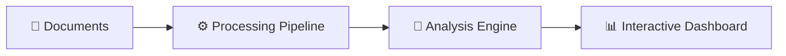

# 🚀 GenAI Hackathon: AI-Powered Startup Analysis Platform

An intelligent startup evaluation platform that leverages AI to analyze pitch decks, call transcripts, and business documents to generate comprehensive investment insights with scoring and recommendations.

## 🎯 Quick Links

📋 **[Quick Start Guide](./docs/quick-start.md)** - Get started in 5 minutes  
📖 **[Full Documentation](./docs/)** - Complete documentation directory  
🎪 **[Live Demo](https://genai-crew-ai-analyst-71997682706.asia-south2.run.app/)** - Try it now  

### 📋 **Hackathon Documentation**
🔗 **[Gen AI Exchange Hackathon Syncing Doc](https://docs.google.com/document/d/1Ll4_gXUX88Tt-9rIGWxXLOzS1FB-LyOw9NBrFh9YXA8/edit?usp=sharing)**

## ✨ Key Features

### 🔍 **Intelligent Analysis**
- 📄 Multi-format document processing (PDF, DOCX, TXT)
- 🧠 AI-powered parameter extraction and scoring
- 📊 8-parameter evaluation system with weighted scoring
- 🚨 Automated red flag detection with page references

### 📊 **Interactive Dashboard**
- ⚡ Real-time scoring updates
- ✏️ Editable parameters with instant recalculation
- 📈 Visual analytics and trend analysis
- 📥 Export-ready reports (coming soon)

## 🎪 Quick Demo

```bash
🚀 streamlit run app.py
```
🌐 Visit `http://localhost:8501` to access the web interface.

---

## ✨ Features

### 🏢 **Pre-loaded Company Data**
- 📊 **14 Pre-loaded Startups**: Ready-to-analyze company data from various sectors
- 🎯 **Quick Selection Cards**: Featured startups with industry badges for easy access
- 📂 **Automatic Document Categorization**: Smart classification of pitch decks, memos, and financials
- 🔄 **Dual Mode Operation**: Choose between pre-loaded companies or upload custom documents

### 📄 **Document Management**
- 👁️ **PDF Preview**: In-browser PDF viewer for document verification
- 📥 **Individual Downloads**: Download specific documents per company
- 📦 **Bulk Download**: ZIP archive with all company documents
- 📝 **Document Type Detection**: Automatic categorization of uploaded files

### 🔍 **Document Analysis**
- 📄 **Multi-format Support**: PDF, DOCX, TXT file processing
- 👁️ **OCR Capabilities**: Extract text from scanned documents using Google Cloud Vision
- 🧠 **Intelligent Parsing**: AI-powered content extraction and structuring
- 🏷️ **Sector-Specific Analysis**: Tailored evaluation based on company industry

### 📊 **AI-Powered Startup Evaluation**
- 🎯 **8-Parameter Evaluation**: Comprehensive scoring across key business dimensions
- ⚖️ **Weighted Scoring**: Customizable weightage for different parameters
- 📈 **Benchmark Comparison**: Industry-specific performance benchmarks with peer companies
- 🚨 **Red Flag Detection**: Automated risk identification with sector-specific considerations

### 🎨 **Interactive Dashboard**
- ⚡ **Real-time Analysis**: Live scoring updates as you modify parameters
- 📊 **Visual Analytics**: Interactive charts and trend analysis
- ✏️ **Editable Data**: Modify scores and see instant impact on final rating
- 📥 **Export Reports**: Download analysis results as CSV
- 🏢 **Company Context**: Displays analyzed company name and metadata throughout

### 🤖 **AI Integration**
- 🔮 **Smart Extraction**: AI-powered parameter extraction from documents 🚧 **[PLANNED]**
- 💡 **Recommendation Engine**: Contextual investment recommendations ✅ **[IMPLEMENTED]**
- ⚠️ **Risk Assessment**: Intelligent risk factor identification ✅ **[IMPLEMENTED]**

---

## 🏗️ Architecture

### 🏛️ **High-Level System Overview**


🌐 Visit `http://localhost:8501` to access the application

## 🚀 Installation

### Prerequisites
- Python 3.8+
- pip package manager

### Setup
```bash
# Clone repository
git clone <repository-url>
cd GenAI_Hackathon

# Create virtual environment
python -m venv venv
source venv/bin/activate  # On Windows: venv\Scripts\activate

# Install dependencies
pip install -r requirements.txt

# Run application
streamlit run app.py
```

📖 **[Detailed Setup Instructions](./docs/SETUP_INSTRUCTIONS.md)**

## 📚 Documentation

### 🏗️ Technical Documentation
- **[Architecture Overview](./docs/architecture.md)** - System design and components
- **[Data Flow](./docs/data-flow.md)** - How data moves through the system
- **[API Reference](./docs/api-reference.md)** - Function documentation and usage
- **[Configuration Guide](./docs/configuration.md)** - Customization options

### 🎨 User Documentation
- **[UI/UX Guide](./docs/UI-UX.md)** - Interface components and user flows
- **[Quick Start](./docs/quick-start.md)** - Get started quickly
- **[Troubleshooting](./docs/troubleshooting.md)** - Common issues and solutions

### 📁 Development Resources
- **[Project Structure](./docs/project-structure.md)** - File organization and modules
- **[Sample Data](./docs/sample-data.md)** - Data formats and examples

## 🎯 How It Works

### 1️⃣ Upload Documents
Upload your startup documents:
- 📊 **Pitch Deck** (PDF) - Required
- 📝 **Call Transcript** (TXT) - Optional
- 👤 **Founder Material** (DOCX) - Optional

### 2️⃣ AI Analysis
The system analyzes 8 key parameters:
- 👥 Team Quality (15%)
- 🌍 Market Size (15%)
- 📈 Traction (15%)
- 💰 Financials (10%)
- 🚀 Product Uniqueness (15%)
- 🏆 Competition (10%)
- 💼 Business Model (10%)
- ⚠️ Risk Factors (10%)

### 3️⃣ Get Results
Receive comprehensive analysis:
- 📊 Overall score (0-10)
- 🎯 Individual parameter scores
- 🚨 Red flags with page references
- 💡 Actionable recommendations

## 📁 Project Structure

```
GenAI_Hackathon/
├── 📚 docs/                # All documentation
├── 🖥️ app.py              # Main application
├── ⚙️ analyse_pipeline.py  # Analysis engine
├── 🔧 Utils/               # Utility modules
├── 📊 data/                # Benchmarks & samples
└── 📤 input/               # Sample documents
```

📖 **[Full Project Structure](./docs/project-structure.md)**

## 🔧 Core Functions

### Main Pipeline
```python
# Process uploaded files and generate analysis
summary_df, results_df, score, flags, recommendations = create_results(uploaded_files)

# Re-analyze after parameter modifications
score, flags, recommendations = analyze_results(modified_df)
```

📖 **[Complete API Reference](./docs/api-reference.md)**


## 🤝 Contributing

We welcome contributions! Please see our contributing guidelines and submit pull requests.

## 🆘 Support

- 📖 **[Documentation](./docs/)** - Complete guides
- 🔍 **[Troubleshooting](./docs/troubleshooting.md)** - Common issues
- 📊 **[Sample Data](./docs/sample-data.md)** - Test with examples
- 💬 **[Issues](https://github.com/your-repo/issues)** - Report bugs

---

**Built with ❤️ for GenAI Hackathon**
