# 🚀 GenAI Hackathon: AI-Powered Startup Analysis Platform

## 📋 Table of Contents
- [🎯 Overview](#overview)
- [✨ Features](#features)
- [🎨 UI/UX Documentation](#ui-ux-documentation)
- [🏗️ Architecture](#architecture)
- [🚀 Installation](#installation)
- [📖 Usage](#usage)
- [📁 Project Structure](#project-structure)
- [🔄 Data Flow](#data-flow)
- [🔧 API Reference](#api-reference)
- [⚙️ Configuration](#configuration)
- [🔍 Troubleshooting](#troubleshooting)
- [📊 Sample Data](#sample-data)

## 🎯 Overview

**GenAI Hackathon** is an intelligent startup analysis platform that leverages AI to evaluate startups and provide investment insights. The system analyzes pitch decks, call transcripts, and other business documents to generate comprehensive scoring reports with actionable recommendations.

### 📋 **Hackathon Documentation**
🔗 **[Gen AI Exchange Hackathon Syncing Doc](https://docs.google.com/document/d/1Ll4_gXUX88Tt-9rIGWxXLOzS1FB-LyOw9NBrFh9YXA8/edit?usp=sharing)**

### 🎪 **Quick Demo**
```bash
🚀 streamlit run app.py
```
🌐 Visit `http://localhost:8501` to access the web interface.

---

## ✨ Features

### 🔍 **Document Analysis**
- 📄 **Multi-format Support**: PDF, DOCX, TXT file processing
- 👁️ **OCR Capabilities**: Extract text from scanned documents using Google Cloud Vision
- 🧠 **Intelligent Parsing**: AI-powered content extraction and structuring

### 📊 **Startup Scoring System**
- 🎯 **8-Parameter Evaluation**: Comprehensive scoring across key business dimensions
- ⚖️ **Weighted Scoring**: Customizable weightage for different parameters
- 📈 **Benchmark Comparison**: Industry-specific performance benchmarks
- 🚨 **Red Flag Detection**: Automated risk identification with page references

### 🎨 **Interactive Dashboard**
- ⚡ **Real-time Analysis**: Live scoring updates as you modify parameters
- 📊 **Visual Analytics**: Interactive charts and trend analysis
- ✏️ **Editable Data**: Modify scores and see instant impact on final rating
- 📥 **Export Reports**: Download analysis results (coming soon)

### 🤖 **AI Integration**
- 🔮 **Smart Extraction**: AI-powered parameter extraction from documents 🚧 **[PLANNED]**
- 💡 **Recommendation Engine**: Contextual investment recommendations ✅ **[IMPLEMENTED]**
- ⚠️ **Risk Assessment**: Intelligent risk factor identification ✅ **[IMPLEMENTED]**

---

## 🎨 UI/UX Documentation

For detailed user interface and experience documentation, including:
- 📱 **Component Structure**: Detailed breakdown of all UI components
- 🎯 **User Journey Maps**: Complete user interaction flows
- 🖼️ **Visual Design Guidelines**: Color schemes, typography, and layouts
- 📊 **Dashboard Components**: Interactive elements and data visualizations
- 🔄 **State Management**: Session handling and real-time updates

📖 **See the complete [UI-UX Documentation](./UI-UX.md)**

---

## 🏗️ Architecture

### 🎯 **Frontend-Backend Separation**

The application follows a clear **Frontend-Backend architecture**:

- **🖥️ Frontend (`app.py`)**: Streamlit-based UI that handles user interactions, file uploads, and data visualization
- **⚙️ Backend (`analyse_pipeline.py`)**: Core processing engine that performs analysis, scoring, and recommendation generation

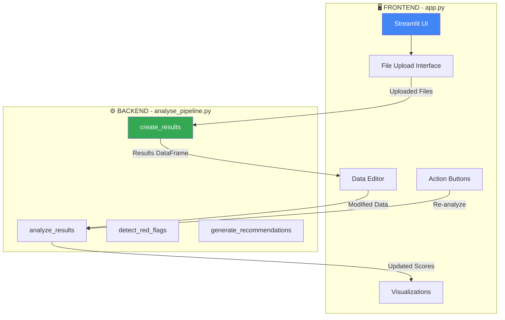

### 🔄 **Complete Application Flow**

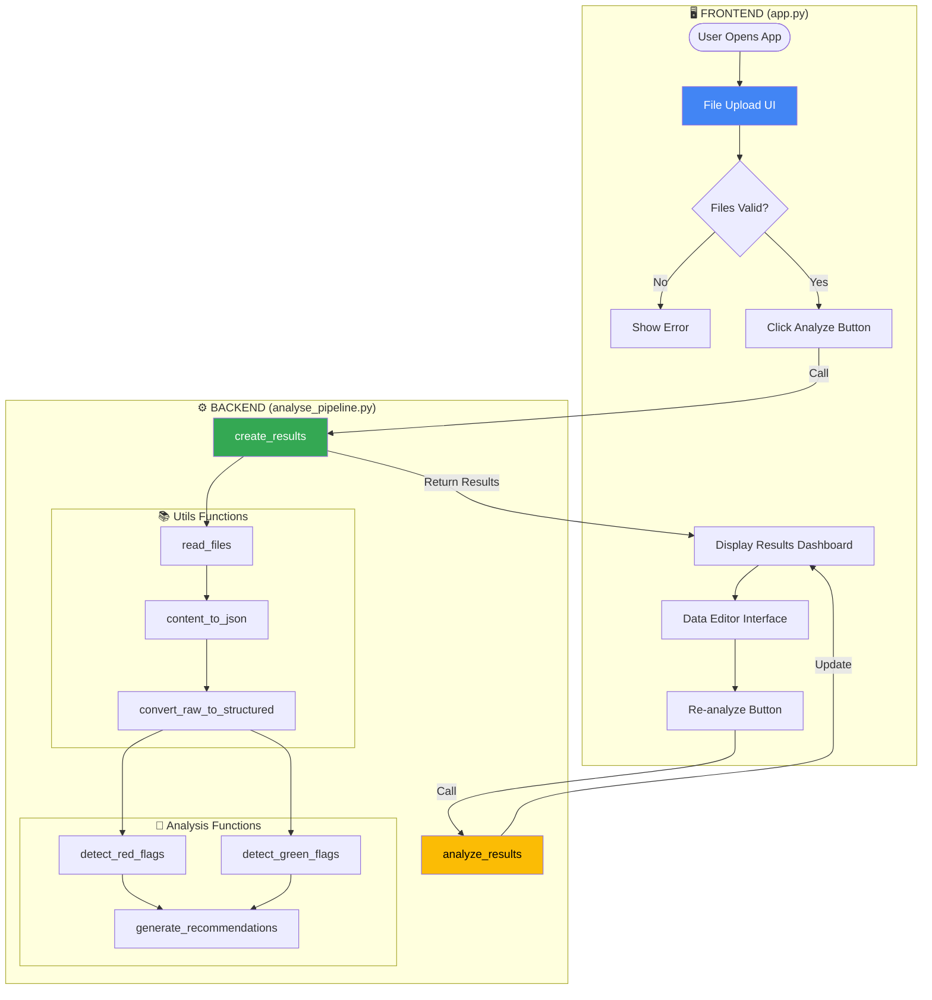

### 🏛️ **High-Level System Overview**
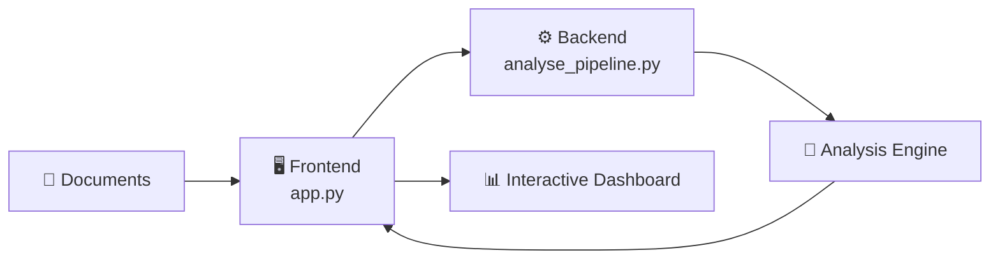

### 📋 **Key Function Calls Between Frontend & Backend**

| **Frontend Action (app.py)** | **Backend Function Called** | **Purpose** | **Returns** |
|------------------------------|----------------------------|------------|-------------|
| **User clicks "🔍 Analyze"** | `create_results(uploaded_files)` | Initial document analysis | summary_df, results_df, score, flags, recommendations |
| **User edits data in UI** | `analyze_results(structured_df)` | Re-calculate scores | final_score, flags, recommendations |
| **User clicks "🔄 Re-analyze"** | `analyze_results(structured_df)` | Refresh analysis | final_score, flags, recommendations |
| **Dashboard loads** | Uses returned DataFrames | Display results | N/A - uses stored session state |

### 🔧 **Detailed Architecture Layers**

#### **🎨 Layer 1: Frontend User Interface (`app.py`)**
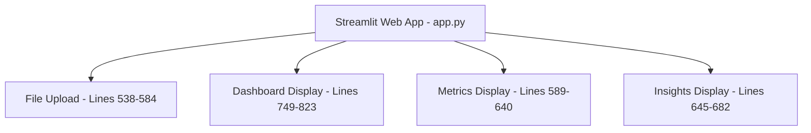

#### **⚙️ Layer 2: Backend Processing Pipeline (`analyse_pipeline.py`)**
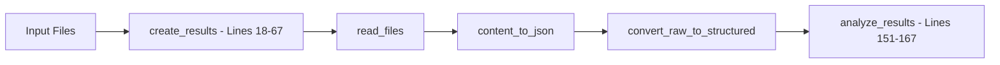

#### **🧠 Layer 3: Analysis Engine (8 Parameters)**
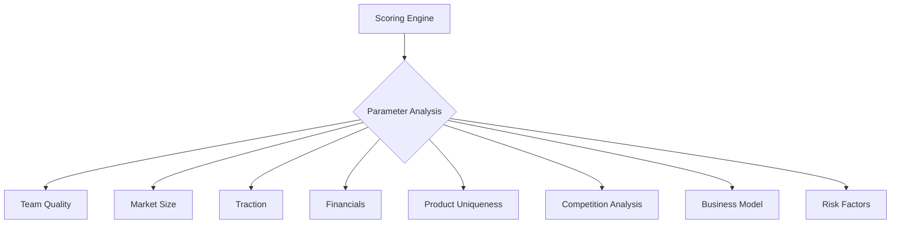

#### **🤖 Layer 4: Intelligence & Output**
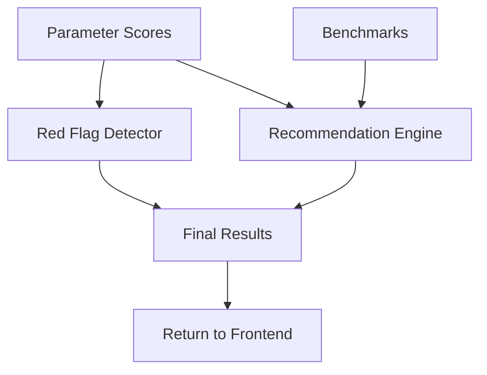

### 🧩 Detailed Component Architecture

#### **🎨 1. User Interface Layer** 
- **🖥️ [`Streamlit Web App`](./app.py)** - Main application interface
  - **📤 [File Upload Interface](./app.py#L18-L23)**: Multi-format document upload with validation
  - **📊 [Interactive Dashboard](./app.py#L35-L89)**: Real-time results display and editing
  - **📈 [Data Visualizations](./app.py#L78-L89)**: Charts, trends, and benchmark comparisons

#### **⚙️ 2. Processing Pipeline Layer**
- **🔄 [`Main Pipeline`](./analyse_pipeline.py#L7-L55)** - Orchestrates entire analysis workflow
  - **📖 [`File Reader`](./Utils/utils.py#L42-L51)** - Batch processing of uploaded documents
  - **🔍 [`Parameter Extractor`](./Utils/pdf_file_reader.py#L15-L51)** - AI-powered content analysis
  - **🎯 [`Scoring Engine`](./Utils/structured_2_scored_data.py#L69-L146)** - Transforms text to numerical scores

#### **🧠 3. Analysis Engine** - 8-Parameter Evaluation System
- **👥 [`Team Scorer`](./Utils/structured_2_scored_data.py#L44-L51)** - Educational background + experience analysis
- **🌍 [`Market Analyzer`](./Utils/structured_2_scored_data.py#L9-L24)** - TAM size evaluation with regex parsing
- **📈 [`Traction Evaluator`](./Utils/structured_2_scored_data.py#L26-L42)** - User growth + MoM metrics
- **💰 [Financial Scorer](./Utils/structured_2_scored_data.py#L87)** - Revenue, ARR, burn rate assessment
- **🚀 [Product Scorer](./Utils/structured_2_scored_data.py#L88)** - Innovation, differentiation, AI/tech analysis
- **🏆 [Competition Analyzer](./Utils/structured_2_scored_data.py#L89-L91)** - Market saturation and competitive positioning
- **💼 [Business Model Scorer](./Utils/structured_2_scored_data.py#L92)** - Revenue model clarity and scalability
- **⚠️ [Risk Assessor](./Utils/structured_2_scored_data.py#L93)** - Regulatory, operational, market risk evaluation

#### **🤖 4. Intelligence Layer** - Advanced Analytics
- **🚨 [`Red Flag Detector`](./analyse_pipeline.py#L88-L110)** - Threshold-based risk identification
- **💡 [`Recommendation Engine`](./analyse_pipeline.py#L112-L118)** - Actionable insights generation
- **📊 [`Benchmark Comparator`](./data/sector_benchmarks.csv)** - Industry-specific performance analysis

#### **📚 5. Data Layer** - Information Management
- **📄 Input Documents** - Multi-format file processing (PDF, DOCX, TXT)
- **📊 Benchmark Data** - Sector-specific performance metrics
- **⚙️ Configuration** - Parameter weights, thresholds, scoring rules
- **📋 Analysis Results** - Structured output with scores, flags, recommendations

---

### 🔄 **Data Flow Architecture**

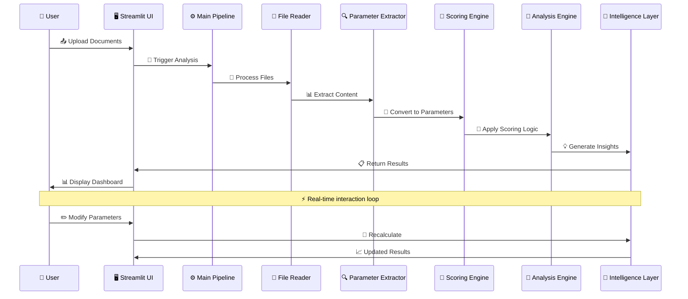

---

### 🔄 **Execution Flow**

#### **🚀 Initial Analysis Flow** (When User Clicks "🔍 Analyse")

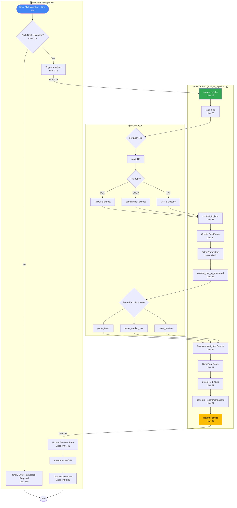

#### **🔄 Re-Analysis Flow** (When User Clicks "🔄 Analyse Again")

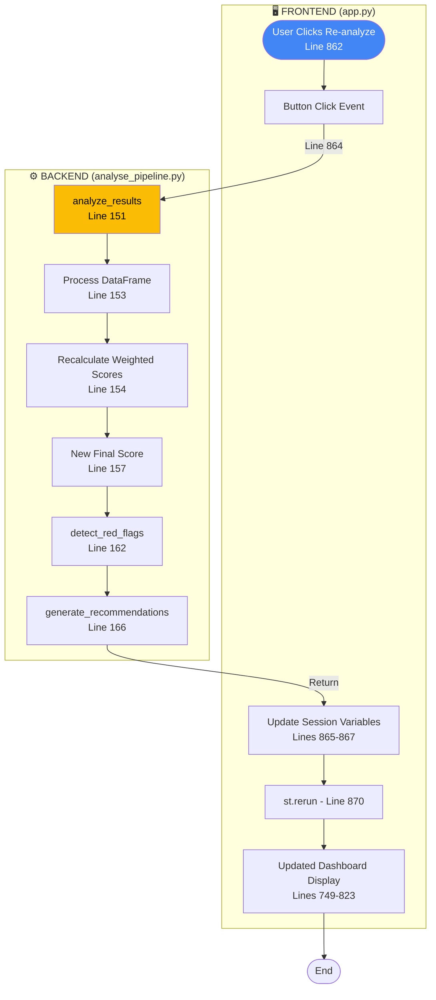

#### **✏️ Interactive Parameter Editing Flow** (Real-time Updates)

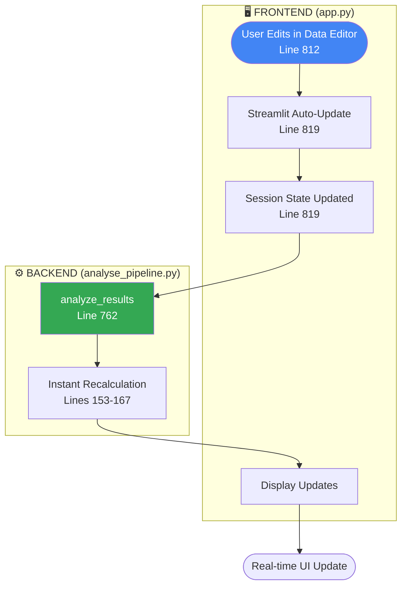

#### **⚡ Key Execution Points**

| **🎯 Execution Stage** | **🔧 Function Called** | **📁 File Location** |
|---------------------|-------------------|------------------|
| **📤 File Upload Validation** | File upload check | [`app.py:26-27`](./app.py#L26-L27) |
| **📖 File Content Reading** | [`read_files()`](./Utils/utils.py#L42-L51) | `Utils/utils.py` |
| **🔍 Parameter Extraction** | [`content_to_json()`](./Utils/pdf_file_reader.py#L15-L51) | `Utils/pdf_file_reader.py` |
| **🎯 Scoring Conversion** | [`convert_raw_to_structured()`](./Utils/structured_2_scored_data.py#L69-L146) | `Utils/structured_2_scored_data.py` |
| **📊 Individual Parameter Scoring** | [`parse_team()`](./Utils/structured_2_scored_data.py#L44-L51), [`parse_market_size()`](./Utils/structured_2_scored_data.py#L9-L24), etc. | `Utils/structured_2_scored_data.py` |
| **🧮 Final Score Calculation** | Weighted sum | [`analyse_pipeline.py:38-41`](./analyse_pipeline.py#L38-L41) |
| **🚨 Red Flag Detection** | [`detect_red_flags()`](./analyse_pipeline.py#L88-L110) | `analyse_pipeline.py` |
| **💡 Recommendation Generation** | [`generate_recommendations()`](./analyse_pipeline.py#L112-L118) | `analyse_pipeline.py` |
| **📊 Dashboard Display** | Streamlit rendering | [`app.py:35-89`](./app.py#L35-L89) |

#### **⚠️ Error Handling Points**

- **📤 File Upload Validation** - [`app.py:26-28`](./app.py#L26-L28) - Missing pitch deck check
- **📖 File Reading Errors** - [`Utils/utils.py:30-31`](./Utils/utils.py#L30-L31) - DOCX processing exceptions  
- **🔍 Content Extraction** - [`Utils/pdf_file_reader.py`](./Utils/pdf_file_reader.py) - Malformed document handling
- **🎯 Scoring Validation** - [`Utils/structured_2_scored_data.py`](./Utils/structured_2_scored_data.py) - Invalid parameter values

---

## 🚀 Installation

### 📋 **Prerequisites**
- 🐍 **Python 3.8+**
- 📦 **pip package manager**
- ☁️ **Google Cloud Vision API** (optional, for OCR)

### ⚡ **Quick Setup**
```bash
# 📥 Clone the repository
git clone <repository-url>
cd GenAI_Hackathon

# 🏗️ Create virtual environment
python -m venv .venv
source .venv/bin/activate  # On Windows: .venv\Scripts\activate

# 📦 Install dependencies
pip install -r requirements.txt

# 🚀 Run the application
streamlit run app.py
```

### 📚 **Dependencies**
```
streamlit>=1.28.0     # 🖥️ Web framework
pandas>=1.5.0         # 📊 Data manipulation
PyPDF2>=3.0.0         # 📄 PDF processing
python-docx>=0.8.11   # 📝 Word document processing
google-cloud-vision>=3.4.0  # 👁️ OCR (Optional)
numpy>=1.24.0         # 🔢 Numerical computing
```

---

## 📖 Usage

### 📤 **1. Document Upload**
```python
# 📋 Supported file types
SUPPORTED_FORMATS = {
    '📄 pdf': 'Pitch decks, financial reports',
    '📝 docx': 'Business plans, founder profiles', 
    '📄 txt': 'Call transcripts, notes'
}
```

### 🔄 **2. Analysis Process**
1. **📤 Upload Documents**: Drag and drop files (Pitch deck is mandatory)
2. **🔍 Click Analyze**: System processes documents and extracts parameters
3. **📊 Review Results**: Interactive dashboard with scores and insights
4. **✏️ Modify Parameters**: Edit scores to see impact on final rating
5. **📥 Export Report**: Download comprehensive analysis (coming soon)

### 🎯 **3. Scoring Parameters**

| **📊 Parameter** | **⚖️ Weight** | **📋 Description** | **🎯 Score Range** |
|-----------|--------|-------------|-------------|
| **👥 Team Quality** | 15% | Educational background, experience | 1-10 |
| **🌍 Market Size** | 15% | Total addressable market analysis | 1-10 |
| **📈 Traction** | 15% | User growth, engagement metrics | 1-10 |
| **💰 Financials** | 10% | Revenue, profitability, burn rate | 1-10 |
| **🚀 Product Uniqueness** | 15% | Innovation, differentiation | 1-10 |
| **🏆 Competitive Landscape** | 10% | Market competition analysis | 1-10 |
| **💼 Business Model Clarity** | 10% | Revenue model, scalability | 1-10 |
| **⚠️ Risk Factors** | 10% | Regulatory, operational risks | 1-10 |

---

## 📁 Project Structure

```
🚀 GenAI_Hackathon/
├── 🖥️ app.py                    # Main Streamlit application
├── ⚙️ analyse_pipeline.py       # Core analysis pipeline
├── 📋 README.md                 # Main documentation (this file)
├── 📝 readme.md                 # Secondary readme file
├── 📦 requirements.txt          # Python dependencies
├── 🐍 __init__.py               # Python package initialization
│
├── 🔧 Utils/                    # Utility modules
│   ├── 🛠️ utils.py              # File processing utilities
│   ├── 📄 pdf_file_reader.py    # PDF content extraction
│   ├── 🎯 structured_2_scored_data.py  # Scoring algorithms
│   └── 🧮 final_score.py        # Final score calculation
│
├── 🛠️ tools/                    # Processing tools
│   ├── 🔨 tools.py              # PDF processing tools
│   ├── 💬 prompts.py            # AI prompts and templates
│   └── 🐍 __init__.py           # Package initialization
│
├── 📊 data/                     # Data and benchmarks
│   ├── 📈 sector_benchmarks.csv # Industry benchmarks
│   ├── 📋 data_extracted.json   # Sample extracted data
│   ├── 🔄 data_normalized.json  # Processed data samples
│   ├── 📊 data_score.json       # Scored data results
│   ├── 📝 data_score_sample.json # Sample scoring data
│   └── 📁 archieve/             # Historical data
│       └── 📋 startup_parameters.csv
│
├── 📤 input/                    # Sample documents
│   ├── 📊 startup_ptch_deck.pdf # Main startup pitch deck
│   ├── 📈 FinTechX_ AI-Powered SME Lending Revolution.pdf # FinTech example
│   ├── 📝 transcript.txt        # Call transcript sample
│   ├── 📝 pitch_deck_draft.txt  # Text-based pitch deck
│   ├── 📧 email.docx            # Email communication sample
│   └── 👤 founder_material.docx # Founder background info
```

---

## 🔄 Data Flow

### 📤 **1. Input Processing**
**📁 File Upload & Validation**
- **🖥️ UI Components**: See [`app.py:18-23`](./app.py#L18-L23) for Streamlit file uploaders
- **📖 File Processing**: [`read_files()`](./Utils/utils.py#L42-L51) function in `Utils/utils.py`
- **📄 Individual File Reading**: [`read_file()`](./Utils/utils.py#L8-L39) function in `Utils/utils.py`

**⚙️ Supported Operations:**
- **📄 PDF Processing**: PyPDF2-based text extraction ([`read_file()` lines 18-24](./Utils/utils.py#L18-L24))
- **📝 DOCX/DOC Processing**: python-docx integration ([`read_file()` lines 26-32](./Utils/utils.py#L26-L32)) 
- **📄 TXT Processing**: UTF-8 decoding ([`read_file()` lines 34-35](./Utils/utils.py#L34-L35))

### 🤖 **2. AI Analysis & Content Extraction** 🚧 **[PARTIALLY IMPLEMENTED]**
**🔄 Content Structure Conversion**
- **🧠 Main Function**: [`content_to_json()`](./Utils/pdf_file_reader.py#L15-L51) 🚧 **[TO BE IMPLEMENTED]** - Currently uses sample data
- **📊 DataFrame Creation**: See [`analyse_pipeline.py:23-28`](./analyse_pipeline.py#L23-L28) ✅ **[WORKING]** - Parameter extraction pipeline
- **🔍 Data Filtering**: Non-evaluating parameters removed ([lines 29-30](./analyse_pipeline.py#L29-L30)) ✅ **[WORKING]**

**📋 Output Format**: Structured JSON with company parameters (name, sector, team, market, traction, revenue, USP, competition, risks)
**⚠️ Note**: Currently uses hardcoded sample data - AI integration needed for production use

### 🎯 **3. Scoring Pipeline**
**🔧 Parameter Scoring Functions** - All in [`Utils/structured_2_scored_data.py`](./Utils/structured_2_scored_data.py):
- **👥 Team Quality**: [`parse_team()`](./Utils/structured_2_scored_data.py#L44-L51) function - IIT/IIM bonus scoring
- **🌍 Market Size**: [`parse_market_size()`](./Utils/structured_2_scored_data.py#L9-L24) function - Billion/Million market analysis  
- **📈 Traction**: [`parse_traction()`](./Utils/structured_2_scored_data.py#L26-L42) function - User growth and MoM metrics
- **📊 Other Parameters**: [Lines 84-94](./Utils/structured_2_scored_data.py#L84-L94) for Financials, Product Uniqueness, Competition, etc.

**⚖️ Weighted Calculation**:
- **🎯 Weights Definition**: [Lines 117-126](./Utils/structured_2_scored_data.py#L117-L126) in structured_2_scored_data.py
- **🧮 Score Calculation**: [`analyse_pipeline.py:38-43`](./analyse_pipeline.py#L38-L43) for weighted final score

### 📊 **4. Analysis Output & Risk Detection**
**🚨 Red Flag Detection**
- **⚙️ Function**: [`detect_red_flags()`](./analyse_pipeline.py#L88-L110) in `analyse_pipeline.py`
- **🎯 Logic**: Compares scores against thresholds with page references

**💡 Recommendation Engine**
- **⚙️ Function**: [`generate_recommendations()`](./analyse_pipeline.py#L112-L118) in `analyse_pipeline.py`
- **📋 Output**: Parameter-specific actionable insights

---

## 🔧 API Reference

### 🔧 **Core Functions**

#### 🚀 [`create_results(uploaded_files)`](./analyse_pipeline.py#L7-L55)
*📍 Location: `analyse_pipeline.py:7-55`*

**🎯 Purpose**: Main analysis pipeline that processes uploaded files and generates comprehensive startup evaluation.

**🔄 Process Flow**:
1. 📖 Extract content from files using [`read_files()`](./Utils/utils.py#L42-L51) 
2. 🔄 Convert to structured JSON via [`content_to_json()`](./Utils/pdf_file_reader.py#L15-L51)
3. 📊 Create parameter DataFrame ([`create_results()` lines 23-28](./analyse_pipeline.py#L23-L28))
4. 🎯 Apply scoring algorithms via [`convert_raw_to_structured()`](./Utils/structured_2_scored_data.py#L69-L146)
5. ⚖️ Calculate weighted scores and final rating
6. 🚨 Generate red flags via [`detect_red_flags()`](./analyse_pipeline.py#L88-L110) and 💡 recommendations via [`generate_recommendations()`](./analyse_pipeline.py#L112-L118)

**📥 Parameters**: `uploaded_files` - List of Streamlit file objects
**📤 Returns**: summary_df, results_df, final_score, flags, recommendations

---

#### [`analyze_results(structured_df)`](./analyse_pipeline.py#L120-L135)
*Location: `analyse_pipeline.py:120-135`*

**Purpose**: Re-analyzes data after user modifications in interactive dashboard.

**Operations**: Recalculates weighted scores, refreshes red flags, updates recommendations
**Parameters**: `structured_df` - Modified DataFrame from UI
**Returns**: Updated final_score, flags, recommendations

---

### Utility Functions

#### [`read_files(uploaded_files)`](./Utils/utils.py#L42-L51)
*Location: `Utils/utils.py:42-51`*
**Purpose**: Batch file processing for multiple document types
**Calls**: [`read_file()`](./Utils/utils.py#L8-L39) for individual file processing

#### [`content_to_json(content)`](./Utils/pdf_file_reader.py#L15-L51) 🚧 **[TO BE IMPLEMENTED]**
*Location: `Utils/pdf_file_reader.py:15-51`*  
**Purpose**: Converts raw text to structured startup parameters using AI/LLM
**Current Status**: ⚠️ Uses hardcoded sample data - **AI integration pending**
**Next Steps**: Integrate with GPT-4/Claude for dynamic content analysis

#### [`convert_raw_to_structured(raw_df)`](./Utils/structured_2_scored_data.py#L69-L146)
*Location: `Utils/structured_2_scored_data.py:69-146`*
**Purpose**: Transforms parameters into scored format with benchmarks
**Key Functions**: Uses [`parse_team()`](./Utils/structured_2_scored_data.py#L44-L51), [`parse_market_size()`](./Utils/structured_2_scored_data.py#L9-L24), [`parse_traction()`](./Utils/structured_2_scored_data.py#L26-L42) for scoring

### Scoring Functions
*All located in [`Utils/structured_2_scored_data.py`](./Utils/structured_2_scored_data.py)*

- **[`parse_team()`](./Utils/structured_2_scored_data.py#L44-L51)**: Team background scoring with IIT/IIM bonuses
- **[`parse_market_size()`](./Utils/structured_2_scored_data.py#L9-L24)**: Market size analysis with B/M regex parsing  
- **[`parse_traction()`](./Utils/structured_2_scored_data.py#L26-L42)**: User growth and MoM metrics evaluation
- **[Weight/Benchmark Configs](./Utils/structured_2_scored_data.py#L106-L137)**: Parameter weights, thresholds, benchmarks

## ⚙️ Configuration

### Scoring Parameters
**Parameter Weights** - See [`Utils/structured_2_scored_data.py:117-126`](./Utils/structured_2_scored_data.py#L117-L126)
- All weights sum to 1.0 for normalized scoring
- Team, Market, Traction, Product get 15% each (highest priority)
- Other parameters get 10% each

**Risk Thresholds** - See [`Utils/structured_2_scored_data.py:128-137`](./Utils/structured_2_scored_data.py#L128-L137)
- Minimum acceptable scores for red flag detection
- Default threshold: 3/10 for all parameters

**Industry Benchmarks** - See [`Utils/structured_2_scored_data.py:106-115`](./Utils/structured_2_scored_data.py#L106-L115)
- Sector-specific performance comparisons
- Used for relative scoring and recommendations

### File Processing Configuration
**Supported Formats**: PDF, DOCX, DOC, TXT (see [`Utils/utils.py:15-37`](./Utils/utils.py#L15-L37))
**File Size Limits**: Handled by Streamlit default settings
**OCR Support**: Google Cloud Vision integration available in [`tools/tools.py:50-68`](./tools/tools.py#L50-L68)

### Streamlit UI Components
**Main Interface** - See [`app.py:5-113`](./app.py#L5-L113)
- **Upload Phase** ([lines 15-33](./app.py#L15-L33)): File uploaders with validation
- **Analysis Dashboard** ([lines 35-89](./app.py#L35-L89)): Results display with interactive elements
- **Data Editor** ([lines 49-55](./app.py#L49-L55)): Real-time parameter modification
- **Visualizations** ([lines 78-89](./app.py#L78-L89)): Trend charts and comparisons
- **Action Buttons** ([lines 92-109](./app.py#L92-L109)): Re-analyze, download, navigation

**Session State Management** ([lines 8-11](./app.py#L8-L11)): Persistent data across user interactions


## 🔍 Troubleshooting

### Common Issues

**1. PDF Processing Errors**
```bash
# Install additional dependencies
pip install PyPDF2 pdfplumber

# For OCR support
pip install google-cloud-vision
```

**2. Streamlit Import Errors**
```bash
# Upgrade Streamlit
pip install --upgrade streamlit

# Clear cache
streamlit cache clear
```

**3. Memory Issues with Large Files**
```python
# Increase file upload limit in .streamlit/config.toml
[server]
maxUploadSize = 200
```

## 📊 Sample Data

### Input Document Structure
```json
{
  "company_name": "FinTechX",
  "sector": "Finance",
  "founded": "2022",
  "team": "3 founders from IIT Delhi + 10 engineers",
  "market": "Indian SME lending market $50B",
  "traction": "10,000 users, 20% MoM growth",
  "revenue": "INR 2 Cr ARR",
  "unique_selling_point": "AI-driven underwriting with 30% lower default rate",
  "competition": "KreditBee, LendingKart",
  "risks": "Regulatory hurdles, funding dependency"
}
```

### Output Analysis Format
```python
{
  "final_score": 7.8,
  "parameter_scores": {
    "Team_Quality": 8,
    "Market_Size": 9,
    "Traction": 7,
    "Financials": 7,
    "Product_Uniqueness": 8,
    "Competitive_Landscape": 7,
    "Business_Model_Clarity": 7,
    "Risk_Factors": 6
  },
  "red_flags": [
    "Team Score is less than threshold. Refer page No 1",
    "Financial Score is less than benchmark. Refer page no 3"
  ],
  "recommendations": [
    "Strengthen team with industry veterans",
    "Improve financial projections and unit economics"
  ]
}
```
