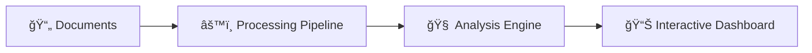
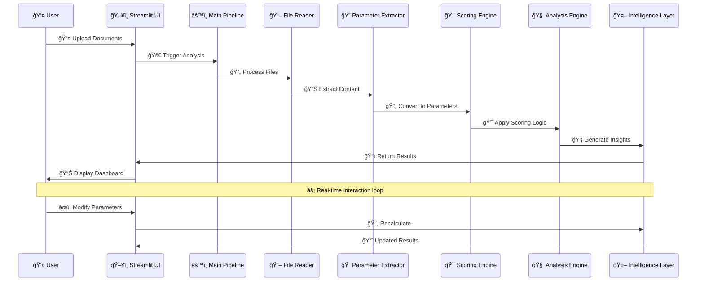

# 🚀 GenAI Hackathon: AI-Powered Startup Analysis Platform

## 📋 Table of Contents
- [🎯 Overview](#overview)
- [✨ Features](#features)
- [🏗️ Architecture](#architecture)
- [🚀 Installation](#installation)
- [📖 Usage](#usage)
- [📁 Project Structure](#project-structure)
- [🔄 Data Flow](#data-flow)
- [🔧 API Reference](#api-reference)
- [⚙️ Configuration](#configuration)
- [🔍 Troubleshooting](#troubleshooting)
- [📊 Sample Data](#sample-data)

## 🎯 Overview

**GenAI Hackathon** is an intelligent startup analysis platform that leverages AI to evaluate startups and provide investment insights. The system analyzes pitch decks, call transcripts, and other business documents to generate comprehensive scoring reports with actionable recommendations.

### 📋 **Hackathon Documentation**
🔗 **[Gen AI Exchange Hackathon Syncing Doc](https://docs.google.com/document/d/1Ll4_gXUX88Tt-9rIGWxXLOzS1FB-LyOw9NBrFh9YXA8/edit?usp=sharing)**

### 🎪 **Quick Demo**
```bash
🚀 streamlit run app.py
```
🌐 Visit `http://localhost:8501` to access the web interface.

---

## ✨ Features

### 🏢 **Pre-loaded Company Data**
- 📊 **14 Pre-loaded Startups**: Ready-to-analyze company data from various sectors
- 🎯 **Quick Selection Cards**: Featured startups with industry badges for easy access
- 📂 **Automatic Document Categorization**: Smart classification of pitch decks, memos, and financials
- 🔄 **Dual Mode Operation**: Choose between pre-loaded companies or upload custom documents

### 📄 **Document Management**
- 👁️ **PDF Preview**: In-browser PDF viewer for document verification
- 📥 **Individual Downloads**: Download specific documents per company
- 📦 **Bulk Download**: ZIP archive with all company documents
- 📝 **Document Type Detection**: Automatic categorization of uploaded files

### 🔍 **Document Analysis**
- 📄 **Multi-format Support**: PDF, DOCX, TXT file processing
- 👁️ **OCR Capabilities**: Extract text from scanned documents using Google Cloud Vision
- 🧠 **Intelligent Parsing**: AI-powered content extraction and structuring
- 🏷️ **Sector-Specific Analysis**: Tailored evaluation based on company industry

### 📊 **AI-Powered Startup Evaluation**
- 🎯 **8-Parameter Evaluation**: Comprehensive scoring across key business dimensions
- ⚖️ **Weighted Scoring**: Customizable weightage for different parameters
- 📈 **Benchmark Comparison**: Industry-specific performance benchmarks with peer companies
- 🚨 **Red Flag Detection**: Automated risk identification with sector-specific considerations

### 🎨 **Interactive Dashboard**
- ⚡ **Real-time Analysis**: Live scoring updates as you modify parameters
- 📊 **Visual Analytics**: Interactive charts and trend analysis
- ✏️ **Editable Data**: Modify scores and see instant impact on final rating
- 📥 **Export Reports**: Download analysis results as CSV
- 🏢 **Company Context**: Displays analyzed company name and metadata throughout

### 🤖 **AI Integration**
- 🔮 **Smart Extraction**: AI-powered parameter extraction from documents 🚧 **[PLANNED]**
- 💡 **Recommendation Engine**: Contextual investment recommendations ✅ **[IMPLEMENTED]**
- ⚠️ **Risk Assessment**: Intelligent risk factor identification ✅ **[IMPLEMENTED]**

---

## 🏗️ Architecture

### 🏛️ **High-Level System Overview**


### 🔧 **Detailed Architecture Layers**

#### **🎨 Layer 1: User Interface**

```mermaid
graph TB
    UI[🖥️ Streamlit Web App]
    UP[📤 File Upload]
    DA[📊 Dashboard]
    
    UI --> UP
    UI --> DA
```


#### **⚙️ Layer 2: Processing Pipeline**

```mermaid
graph LR
    INPUT[📁 Input Files] --> RF[📖 File Reader]
    RF --> PE[🔍 Parameter Extractor]
    PE --> SC[🎯 Scoring Engine]
```


#### **🧠 Layer 3: Analysis Engine (8 Parameters)**

```mermaid
graph TB
    SC[🎯 Scoring Engine] --> PARAMS{📊 Parameter Analysis}
    
    PARAMS --> TS[👥 Team Quality]
    PARAMS --> MS[🌍 Market Size]
    PARAMS --> TR[📈 Traction]
    PARAMS --> FS[💰 Financials]
    PARAMS --> PS[🚀 Product Uniqueness]
    PARAMS --> CS[🏆 Competition Analysis]
    PARAMS --> BS[💼 Business Model]
    PARAMS --> RS[⚠️ Risk Factors]
```


#### **🤖 Layer 4: Intelligence & Output**

```mermaid
graph TB
    SCORES[📊 Parameter Scores] --> RF_ENGINE[🚨 Red Flag Detector]
    SCORES --> REC_ENGINE[💡 Recommendation Engine]
    BENCH[📊 Benchmarks] --> REC_ENGINE
    
    RF_ENGINE --> OUTPUT[📋 Final Results]
    REC_ENGINE --> OUTPUT
    
    OUTPUT --> DASHBOARD[📊 Interactive Dashboard]
```


### 🧩 Detailed Component Architecture

#### **🎨 1. User Interface Layer** 
- **🖥️ [`Streamlit Web App`](./app.py)** - Main application interface
  - **📤 [File Upload Interface](./app.py#L18-L23)**: Multi-format document upload with validation
  - **📊 [Interactive Dashboard](./app.py#L35-L89)**: Real-time results display and editing
  - **📈 [Data Visualizations](./app.py#L78-L89)**: Charts, trends, and benchmark comparisons

#### **⚙️ 2. Processing Pipeline Layer**
- **🔄 [`Main Pipeline`](./analyse_pipeline.py#L7-L55)** - Orchestrates entire analysis workflow
  - **📖 [`File Reader`](./Utils/utils.py#L42-L51)** - Batch processing of uploaded documents
  - **🔍 [`Parameter Extractor`](./Utils/pdf_file_reader.py#L15-L51)** - AI-powered content analysis
  - **🎯 [`Scoring Engine`](./Utils/structured_2_scored_data.py#L69-L146)** - Transforms text to numerical scores

#### **🧠 3. Analysis Engine** - 8-Parameter Evaluation System
- **👥 [`Team Scorer`](./Utils/structured_2_scored_data.py#L44-L51)** - Educational background + experience analysis
- **🌍 [`Market Analyzer`](./Utils/structured_2_scored_data.py#L9-L24)** - TAM size evaluation with regex parsing
- **📈 [`Traction Evaluator`](./Utils/structured_2_scored_data.py#L26-L42)** - User growth + MoM metrics
- **💰 [Financial Scorer](./Utils/structured_2_scored_data.py#L87)** - Revenue, ARR, burn rate assessment
- **🚀 [Product Scorer](./Utils/structured_2_scored_data.py#L88)** - Innovation, differentiation, AI/tech analysis
- **🏆 [Competition Analyzer](./Utils/structured_2_scored_data.py#L89-L91)** - Market saturation and competitive positioning
- **💼 [Business Model Scorer](./Utils/structured_2_scored_data.py#L92)** - Revenue model clarity and scalability
- **⚠️ [Risk Assessor](./Utils/structured_2_scored_data.py#L93)** - Regulatory, operational, market risk evaluation

#### **🤖 4. Intelligence Layer** - Advanced Analytics
- **🚨 [`Red Flag Detector`](./analyse_pipeline.py#L88-L110)** - Threshold-based risk identification
- **💡 [`Recommendation Engine`](./analyse_pipeline.py#L112-L118)** - Actionable insights generation
- **📊 [`Benchmark Comparator`](./data/sector_benchmarks.csv)** - Industry-specific performance analysis

#### **📚 5. Data Layer** - Information Management
- **📄 Input Documents** - Multi-format file processing (PDF, DOCX, TXT)
- **📊 Benchmark Data** - Sector-specific performance metrics
- **⚙️ Configuration** - Parameter weights, thresholds, scoring rules
- **📋 Analysis Results** - Structured output with scores, flags, recommendations

---

### 🔄 **Data Flow Architecture**



---

### 🔄 **Execution Flow**

#### **🚀 Initial Analysis Flow** (When User Clicks "🔍 Analyse")


#### **🔄 Re-Analysis Flow** (When User Clicks "🔄 Analyse Again")


#### **✏️ Interactive Parameter Editing Flow** (Real-time Updates)


#### **⚡ Key Execution Points**

| **🎯 Execution Stage** | **🔧 Function Called** | **📁 File Location** |
|---------------------|-------------------|------------------|
| **📤 File Upload Validation** | File upload check | [`app.py:26-27`](./app.py#L26-L27) |
| **📖 File Content Reading** | [`read_files()`](./Utils/utils.py#L42-L51) | `Utils/utils.py` |
| **🔍 Parameter Extraction** | [`content_to_json()`](./Utils/pdf_file_reader.py#L15-L51) | `Utils/pdf_file_reader.py` |
| **🎯 Scoring Conversion** | [`convert_raw_to_structured()`](./Utils/structured_2_scored_data.py#L69-L146) | `Utils/structured_2_scored_data.py` |
| **📊 Individual Parameter Scoring** | [`parse_team()`](./Utils/structured_2_scored_data.py#L44-L51), [`parse_market_size()`](./Utils/structured_2_scored_data.py#L9-L24), etc. | `Utils/structured_2_scored_data.py` |
| **🧮 Final Score Calculation** | Weighted sum | [`analyse_pipeline.py:38-41`](./analyse_pipeline.py#L38-L41) |
| **🚨 Red Flag Detection** | [`detect_red_flags()`](./analyse_pipeline.py#L88-L110) | `analyse_pipeline.py` |
| **💡 Recommendation Generation** | [`generate_recommendations()`](./analyse_pipeline.py#L112-L118) | `analyse_pipeline.py` |
| **📊 Dashboard Display** | Streamlit rendering | [`app.py:35-89`](./app.py#L35-L89) |

#### **⚠️ Error Handling Points**

- **📤 File Upload Validation** - [`app.py:26-28`](./app.py#L26-L28) - Missing pitch deck check
- **📖 File Reading Errors** - [`Utils/utils.py:30-31`](./Utils/utils.py#L30-L31) - DOCX processing exceptions  
- **🔍 Content Extraction** - [`Utils/pdf_file_reader.py`](./Utils/pdf_file_reader.py) - Malformed document handling
- **🎯 Scoring Validation** - [`Utils/structured_2_scored_data.py`](./Utils/structured_2_scored_data.py) - Invalid parameter values

---

## 🚀 Installation

### 📋 **Prerequisites**
- 🐍 **Python 3.8+**
- 📦 **pip package manager**
- ☁️ **Google Cloud Vision API** (optional, for OCR)

### ⚡ **Quick Setup**
```bash
# 📥 Clone the repository
git clone <repository-url>
cd GenAI_Hackathon

# 🏗️ Create virtual environment
python -m venv .venv
source .venv/bin/activate  # On Windows: .venv\Scripts\activate

# 📦 Install dependencies
pip install -r requirements.txt

# 🚀 Run the application
streamlit run app.py
```

### 📚 **Dependencies**
```
streamlit>=1.28.0     # 🖥️ Web framework
pandas>=1.5.0         # 📊 Data manipulation
PyPDF2>=3.0.0         # 📄 PDF processing
python-docx>=0.8.11   # 📝 Word document processing
google-cloud-vision>=3.4.0  # 👁️ OCR (Optional)
numpy>=1.24.0         # 🔢 Numerical computing
```

---

## 📖 Usage

### 📤 **1. Document Upload**
```python
# 📋 Supported file types
SUPPORTED_FORMATS = {
    '📄 pdf': 'Pitch decks, financial reports',
    '📝 docx': 'Business plans, founder profiles', 
    '📄 txt': 'Call transcripts, notes'
}
```

### 🔄 **2. Analysis Process**
1. **📤 Upload Documents**: Drag and drop files (Pitch deck is mandatory)
2. **🔍 Click Analyze**: System processes documents and extracts parameters
3. **📊 Review Results**: Interactive dashboard with scores and insights
4. **✏️ Modify Parameters**: Edit scores to see impact on final rating
5. **📥 Export Report**: Download comprehensive analysis (coming soon)

### 🎯 **3. Scoring Parameters**

| **📊 Parameter** | **⚖️ Weight** | **📋 Description** | **🎯 Score Range** |
|-----------|--------|-------------|-------------|
| **👥 Team Quality** | 15% | Educational background, experience | 1-10 |
| **🌍 Market Size** | 15% | Total addressable market analysis | 1-10 |
| **📈 Traction** | 15% | User growth, engagement metrics | 1-10 |
| **💰 Financials** | 10% | Revenue, profitability, burn rate | 1-10 |
| **🚀 Product Uniqueness** | 15% | Innovation, differentiation | 1-10 |
| **🏆 Competitive Landscape** | 10% | Market competition analysis | 1-10 |
| **💼 Business Model Clarity** | 10% | Revenue model, scalability | 1-10 |
| **⚠️ Risk Factors** | 10% | Regulatory, operational risks | 1-10 |

---

## 📁 Project Structure

```
🚀 GenAI_Hackathon/
├── 🖥️ app.py                    # Main Streamlit application
├── ⚙️ analyse_pipeline.py       # Core analysis pipeline
├── 📋 README.md                 # Main documentation (this file)
├── 📝 readme.md                 # Secondary readme file
├── 📦 requirements.txt          # Python dependencies
├── 🐍 __init__.py               # Python package initialization
│
├── 🔧 Utils/                    # Utility modules
│   ├── 🛠️ utils.py              # File processing utilities
│   ├── 📄 pdf_file_reader.py    # PDF content extraction
│   ├── 🎯 structured_2_scored_data.py  # Scoring algorithms
│   └── 🧮 final_score.py        # Final score calculation
│
├── 🛠️ tools/                    # Processing tools
│   ├── 🔨 tools.py              # PDF processing tools
│   ├── 💬 prompts.py            # AI prompts and templates
│   └── 🐍 __init__.py           # Package initialization
│
├── 📊 data/                     # Data and benchmarks
│   ├── 📈 sector_benchmarks.csv # Industry benchmarks
│   ├── 📋 data_extracted.json   # Sample extracted data
│   ├── 🔄 data_normalized.json  # Processed data samples
│   ├── 📊 data_score.json       # Scored data results
│   ├── 📝 data_score_sample.json # Sample scoring data
│   └── 📁 archieve/             # Historical data
│       └── 📋 startup_parameters.csv
│
├── 📤 input/                    # Sample documents
│   ├── 📊 startup_ptch_deck.pdf # Main startup pitch deck
│   ├── 📈 FinTechX_ AI-Powered SME Lending Revolution.pdf # FinTech example
│   ├── 📝 transcript.txt        # Call transcript sample
│   ├── 📝 pitch_deck_draft.txt  # Text-based pitch deck
│   ├── 📧 email.docx            # Email communication sample
│   └── 👤 founder_material.docx # Founder background info
```

---

## 🔄 Data Flow

### 📤 **1. Input Processing**
**📁 File Upload & Validation**
- **🖥️ UI Components**: See [`app.py:18-23`](./app.py#L18-L23) for Streamlit file uploaders
- **📖 File Processing**: [`read_files()`](./Utils/utils.py#L42-L51) function in `Utils/utils.py`
- **📄 Individual File Reading**: [`read_file()`](./Utils/utils.py#L8-L39) function in `Utils/utils.py`

**⚙️ Supported Operations:**
- **📄 PDF Processing**: PyPDF2-based text extraction ([`read_file()` lines 18-24](./Utils/utils.py#L18-L24))
- **📝 DOCX/DOC Processing**: python-docx integration ([`read_file()` lines 26-32](./Utils/utils.py#L26-L32)) 
- **📄 TXT Processing**: UTF-8 decoding ([`read_file()` lines 34-35](./Utils/utils.py#L34-L35))

### 🤖 **2. AI Analysis & Content Extraction** 🚧 **[PARTIALLY IMPLEMENTED]**
**🔄 Content Structure Conversion**
- **🧠 Main Function**: [`content_to_json()`](./Utils/pdf_file_reader.py#L15-L51) 🚧 **[TO BE IMPLEMENTED]** - Currently uses sample data
- **📊 DataFrame Creation**: See [`analyse_pipeline.py:23-28`](./analyse_pipeline.py#L23-L28) ✅ **[WORKING]** - Parameter extraction pipeline
- **🔍 Data Filtering**: Non-evaluating parameters removed ([lines 29-30](./analyse_pipeline.py#L29-L30)) ✅ **[WORKING]**

**📋 Output Format**: Structured JSON with company parameters (name, sector, team, market, traction, revenue, USP, competition, risks)
**⚠️ Note**: Currently uses hardcoded sample data - AI integration needed for production use

### 🎯 **3. Scoring Pipeline**
**🔧 Parameter Scoring Functions** - All in [`Utils/structured_2_scored_data.py`](./Utils/structured_2_scored_data.py):
- **👥 Team Quality**: [`parse_team()`](./Utils/structured_2_scored_data.py#L44-L51) function - IIT/IIM bonus scoring
- **🌍 Market Size**: [`parse_market_size()`](./Utils/structured_2_scored_data.py#L9-L24) function - Billion/Million market analysis  
- **📈 Traction**: [`parse_traction()`](./Utils/structured_2_scored_data.py#L26-L42) function - User growth and MoM metrics
- **📊 Other Parameters**: [Lines 84-94](./Utils/structured_2_scored_data.py#L84-L94) for Financials, Product Uniqueness, Competition, etc.

**⚖️ Weighted Calculation**:
- **🎯 Weights Definition**: [Lines 117-126](./Utils/structured_2_scored_data.py#L117-L126) in structured_2_scored_data.py
- **🧮 Score Calculation**: [`analyse_pipeline.py:38-43`](./analyse_pipeline.py#L38-L43) for weighted final score

### 📊 **4. Analysis Output & Risk Detection**
**🚨 Red Flag Detection**
- **⚙️ Function**: [`detect_red_flags()`](./analyse_pipeline.py#L88-L110) in `analyse_pipeline.py`
- **🎯 Logic**: Compares scores against thresholds with page references

**💡 Recommendation Engine**
- **⚙️ Function**: [`generate_recommendations()`](./analyse_pipeline.py#L112-L118) in `analyse_pipeline.py`
- **📋 Output**: Parameter-specific actionable insights

---

## 🔧 API Reference

### 🔧 **Core Functions**

#### 🚀 [`create_results(uploaded_files)`](./analyse_pipeline.py#L7-L55)
*📍 Location: `analyse_pipeline.py:7-55`*

**🎯 Purpose**: Main analysis pipeline that processes uploaded files and generates comprehensive startup evaluation.

**🔄 Process Flow**:
1. 📖 Extract content from files using [`read_files()`](./Utils/utils.py#L42-L51) 
2. 🔄 Convert to structured JSON via [`content_to_json()`](./Utils/pdf_file_reader.py#L15-L51)
3. 📊 Create parameter DataFrame ([`create_results()` lines 23-28](./analyse_pipeline.py#L23-L28))
4. 🎯 Apply scoring algorithms via [`convert_raw_to_structured()`](./Utils/structured_2_scored_data.py#L69-L146)
5. ⚖️ Calculate weighted scores and final rating
6. 🚨 Generate red flags via [`detect_red_flags()`](./analyse_pipeline.py#L88-L110) and 💡 recommendations via [`generate_recommendations()`](./analyse_pipeline.py#L112-L118)

**📥 Parameters**: `uploaded_files` - List of Streamlit file objects
**📤 Returns**: summary_df, results_df, final_score, flags, recommendations

---

#### [`analyze_results(structured_df)`](./analyse_pipeline.py#L120-L135)
*Location: `analyse_pipeline.py:120-135`*

**Purpose**: Re-analyzes data after user modifications in interactive dashboard.

**Operations**: Recalculates weighted scores, refreshes red flags, updates recommendations
**Parameters**: `structured_df` - Modified DataFrame from UI
**Returns**: Updated final_score, flags, recommendations

---

### Utility Functions

#### [`read_files(uploaded_files)`](./Utils/utils.py#L42-L51)
*Location: `Utils/utils.py:42-51`*
**Purpose**: Batch file processing for multiple document types
**Calls**: [`read_file()`](./Utils/utils.py#L8-L39) for individual file processing

#### [`content_to_json(content)`](./Utils/pdf_file_reader.py#L15-L51) 🚧 **[TO BE IMPLEMENTED]**
*Location: `Utils/pdf_file_reader.py:15-51`*  
**Purpose**: Converts raw text to structured startup parameters using AI/LLM
**Current Status**: ⚠️ Uses hardcoded sample data - **AI integration pending**
**Next Steps**: Integrate with GPT-4/Claude for dynamic content analysis

#### [`convert_raw_to_structured(raw_df)`](./Utils/structured_2_scored_data.py#L69-L146)
*Location: `Utils/structured_2_scored_data.py:69-146`*
**Purpose**: Transforms parameters into scored format with benchmarks
**Key Functions**: Uses [`parse_team()`](./Utils/structured_2_scored_data.py#L44-L51), [`parse_market_size()`](./Utils/structured_2_scored_data.py#L9-L24), [`parse_traction()`](./Utils/structured_2_scored_data.py#L26-L42) for scoring

### Scoring Functions
*All located in [`Utils/structured_2_scored_data.py`](./Utils/structured_2_scored_data.py)*

- **[`parse_team()`](./Utils/structured_2_scored_data.py#L44-L51)**: Team background scoring with IIT/IIM bonuses
- **[`parse_market_size()`](./Utils/structured_2_scored_data.py#L9-L24)**: Market size analysis with B/M regex parsing  
- **[`parse_traction()`](./Utils/structured_2_scored_data.py#L26-L42)**: User growth and MoM metrics evaluation
- **[Weight/Benchmark Configs](./Utils/structured_2_scored_data.py#L106-L137)**: Parameter weights, thresholds, benchmarks

## ⚙️ Configuration

### Scoring Parameters
**Parameter Weights** - See [`Utils/structured_2_scored_data.py:117-126`](./Utils/structured_2_scored_data.py#L117-L126)
- All weights sum to 1.0 for normalized scoring
- Team, Market, Traction, Product get 15% each (highest priority)
- Other parameters get 10% each

**Risk Thresholds** - See [`Utils/structured_2_scored_data.py:128-137`](./Utils/structured_2_scored_data.py#L128-L137)
- Minimum acceptable scores for red flag detection
- Default threshold: 3/10 for all parameters

**Industry Benchmarks** - See [`Utils/structured_2_scored_data.py:106-115`](./Utils/structured_2_scored_data.py#L106-L115)
- Sector-specific performance comparisons
- Used for relative scoring and recommendations

### File Processing Configuration
**Supported Formats**: PDF, DOCX, DOC, TXT (see [`Utils/utils.py:15-37`](./Utils/utils.py#L15-L37))
**File Size Limits**: Handled by Streamlit default settings
**OCR Support**: Google Cloud Vision integration available in [`tools/tools.py:50-68`](./tools/tools.py#L50-L68)

### Streamlit UI Components
**Main Interface** - See [`app.py:5-113`](./app.py#L5-L113)
- **Upload Phase** ([lines 15-33](./app.py#L15-L33)): File uploaders with validation
- **Analysis Dashboard** ([lines 35-89](./app.py#L35-L89)): Results display with interactive elements
- **Data Editor** ([lines 49-55](./app.py#L49-L55)): Real-time parameter modification
- **Visualizations** ([lines 78-89](./app.py#L78-L89)): Trend charts and comparisons
- **Action Buttons** ([lines 92-109](./app.py#L92-L109)): Re-analyze, download, navigation

**Session State Management** ([lines 8-11](./app.py#L8-L11)): Persistent data across user interactions


## 🔍 Troubleshooting

### Common Issues

**1. PDF Processing Errors**
```bash
# Install additional dependencies
pip install PyPDF2 pdfplumber

# For OCR support
pip install google-cloud-vision
```

**2. Streamlit Import Errors**
```bash
# Upgrade Streamlit
pip install --upgrade streamlit

# Clear cache
streamlit cache clear
```

**3. Memory Issues with Large Files**
```python
# Increase file upload limit in .streamlit/config.toml
[server]
maxUploadSize = 200
```

## 📊 Sample Data

### Input Document Structure
```json
{
  "company_name": "FinTechX",
  "sector": "Finance",
  "founded": "2022",
  "team": "3 founders from IIT Delhi + 10 engineers",
  "market": "Indian SME lending market $50B",
  "traction": "10,000 users, 20% MoM growth",
  "revenue": "INR 2 Cr ARR",
  "unique_selling_point": "AI-driven underwriting with 30% lower default rate",
  "competition": "KreditBee, LendingKart",
  "risks": "Regulatory hurdles, funding dependency"
}
```

### Output Analysis Format
```python
{
  "final_score": 7.8,
  "parameter_scores": {
    "Team_Quality": 8,
    "Market_Size": 9,
    "Traction": 7,
    "Financials": 7,
    "Product_Uniqueness": 8,
    "Competitive_Landscape": 7,
    "Business_Model_Clarity": 7,
    "Risk_Factors": 6
  },
  "red_flags": [
    "Team Score is less than threshold. Refer page No 1",
    "Financial Score is less than benchmark. Refer page no 3"
  ],
  "recommendations": [
    "Strengthen team with industry veterans",
    "Improve financial projections and unit economics"
  ]
}
```
