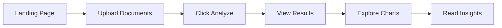

# 🎨 UI/UX Documentation - AI-Powered Startup Analysis Platform

## 📋 Table of Contents
1. [Overview](#overview)
2. [UI Architecture](#ui-architecture)
3. [Design Philosophy](#design-philosophy)
4. [User Journey](#user-journey)
5. [Page Structure](#page-structure)
6. [Component Breakdown](#component-breakdown)
7. [Color System](#color-system)
8. [Interactive Elements](#interactive-elements)
9. [Data Visualizations](#data-visualizations)
10. [Responsive Design](#responsive-design)
11. [Accessibility Features](#accessibility-features)

---

## 🎯 Overview

This Streamlit application provides an AI-powered analysis platform for startup evaluation. It helps investors and analysts assess startup viability through document analysis and intelligent recommendations.

### Key Features:
- 📁 **Document Upload System** - Upload pitch decks and supporting documents
- 🤖 **AI Analysis** - Automated document analysis using Google's Gemini AI
- 📊 **Interactive Dashboards** - Multiple visualization types for data insights
- 💡 **Smart Recommendations** - AI-generated investment recommendations
- 🎨 **Google Material Design** - Clean, modern interface with dark theme

---

## 🎨 UI Architecture

The UI is built with **Streamlit** (`app.py`) and follows Google Material Design principles with a dark theme.

### 📊 **UI Components Overview**

| **Component** | **Function** | **Location** |
|--------------|-------------|------------|
| **Header** | `display_header()` | Lines 231-253 |
| **File Upload** | `handle_file_uploads()` | Lines 538-584 |
| **Metrics Cards** | `display_metrics()` | Lines 589-640 |
| **Charts** | `create_*_chart()` | Lines 284-533 |
| **Insights Panel** | `display_insights()` | Lines 645-682 |
| **Main App** | `main()` | Lines 687-899 |

### 🔄 **UI State Management**

```python
# Session state variables that control the UI
st.session_state.show_results    # Toggle upload/results view
st.session_state.results_df      # Analysis data for charts
st.session_state.summary_df      # Metrics display data
```

---

## 🎨 Design Philosophy

### Core Principles:
1. **Simplicity First** - Complex analysis made simple
2. **Visual Hierarchy** - Important information stands out
3. **Progressive Disclosure** - Show details only when needed
4. **Consistent Feedback** - Users always know what's happening
5. **Google Design Language** - Familiar patterns from Google products

### Theme:
- **Dark Mode** - Reduces eye strain during long analysis sessions
- **Google Colors** - Blue, Red, Yellow, Green for brand consistency
- **High Contrast** - Ensures readability in all conditions

---

## 🚀 User Journey



### Key UI States:

1. **Upload Mode** - Initial state with file uploaders
2. **Loading State** - Progress bar during analysis  
3. **Results Mode** - Dashboard with charts and metrics
4. **Edit Mode** - Interactive data table for modifications

---

## 🏗️ Page Structure

### Header Section
```
┌─────────────────────────────────────────┐
│     🚀 AI-Powered Startup Analysis      │ <- Main Title (3.5rem)
│         ✨ Team Gen AI Crew ✨           │ <- Team Name (2.5rem)
│      GenAI Exchange Hackathon 2025      │ <- Event Info (1rem)
└─────────────────────────────────────────┘
```

### Upload Mode Layout
```
┌─────────────────────────────────────────┐
│            HEADER SECTION                │
├──────────────┬──────────────────────────┤
│   Required   │      Optional            │
│   Documents  │      Documents           │
│              │                          │
│  [PDF Upload]│  [DOC Upload]            │
│              │  [TXT Upload]            │
│              │  [DOC Upload]            │
├──────────────┴──────────────────────────┤
│         [🔍 Analyze Documents]           │
└─────────────────────────────────────────┘
```

### Results Mode Layout
```
┌─────────────────────────────────────────┐
│            HEADER SECTION                │
├─────────────────────────────────────────┤
│    📊 Executive Summary (4 Metrics)      │
│  [Score] [Risk] [Flags] [Recommendations]│
├──────────────┬──────────────────────────┤
│   Gauge      │    Tabbed Charts         │
│   Chart      │  [Trends][Radar][Heat]   │
│              │     [Data Editor]        │
│   Key        │                          │
│   Metrics    │                          │
├──────────────┴──────────────────────────┤
│         🔍 Analysis Insights             │
│   [Risk Assessment] [Recommendations]    │
├─────────────────────────────────────────┤
│  [Re-analyze][Download][Share][New]      │
└─────────────────────────────────────────┘
```

---

## 🧩 Component Breakdown

### 1. **Metrics Cards** 
- **Location**: Lines 589-640
- **Shows**: Score, Risk Level, Red Flags, Recommendations
- **Design**: Google-styled cards with delta indicators

### 2. **File Upload Section**
- **Location**: Lines 538-584  
- **Features**: Drag-and-drop, file validation, success feedback
- **Layout**: 2 columns (Required | Optional)

### 3. **Visualizations**
| **Chart Type** | **Purpose** | **Lines** |
|---------------|------------|-----------|
| **Gauge** | Overall score (0-100) | 284-328 |
| **Line** | Score vs Benchmark trends | 330-420 |
| **Radar** | Multi-parameter view | 422-489 |
| **Heatmap** | Correlation matrix | 491-533 |

### 4. **Insights Panel**
- **Location**: Lines 645-682
- **Risk Cards**: Expandable with severity indicators
- **Recommendations**: AI advice with implementation timeline

### 5. **Data Editor**
- **Location**: Lines 812-819
- **Feature**: Real-time editable table with instant updates

---

## 🎨 Color System

### Primary Colors (Google Brand)
```css
GOOGLE_BLUE    = "#4285F4"  /* Primary actions, links */
GOOGLE_GREEN   = "#34A853"  /* Success states, positive */
GOOGLE_YELLOW  = "#FBBC05"  /* Warnings, attention */
GOOGLE_RED     = "#EA4335"  /* Errors, critical issues */
```

### Background Colors
```css
GOOGLE_DARK_GRAY = "#202124"  /* Main background */
BG_SECONDARY     = "#303134"  /* Card backgrounds */
BG_CARD          = "#3c4043"  /* Elevated surfaces */
```

### Text Colors
```css
TEXT_PRIMARY   = "#e8eaed"  /* Main text */
TEXT_SECONDARY = "#9aa0a6"  /* Subtle text */
```

### Usage Examples:
- **Blue**: Analyze button, primary metrics, links
- **Green**: Success messages, positive trends
- **Yellow**: Medium risk indicators
- **Red**: High risk flags, critical alerts

---

## 🎮 Interactive Elements

### Button Actions
```python
[🔍 Analyze Documents]  # Primary action - Line 728
[🔄 Re-analyze]        # Refresh results - Line 862  
[📥 Download]          # Export CSV - Line 873
[➕ New Analysis]      # Reset UI - Line 887
```

### User Interactions:
1. **File Upload** → Instant visual feedback
2. **Button Click** → Loading state → Results display
3. **Tab Switch** → Instant chart change
4. **Data Edit** → Real-time recalculation
5. **Expander Click** → Smooth content reveal

---

## 📊 Data Visualizations

### 1. **Gauge Chart** (Investment Readiness)
- **What it shows**: Overall startup score
- **How to read**: Higher is better, green zone is ideal
- **Interactive**: Hover for exact value

### 2. **Line Chart** (Performance Trends)
- **What it shows**: Multiple metrics over parameters
- **Blue Line**: Actual scores
- **Red Dashed**: Minimum thresholds
- **Green Line**: Industry benchmarks

### 3. **Radar Chart** (Multi-Parameter View)
- **What it shows**: Strengths and weaknesses
- **Blue Area**: Startup's performance
- **Red Area**: Required minimums
- **Gap Analysis**: Space between shows improvement areas

### 4. **Heatmap** (Correlation Matrix)
- **What it shows**: How parameters relate
- **Dark Red**: Strong negative correlation
- **Dark Green**: Strong positive correlation
- **Gray**: No correlation

### 5. **Bar Chart** (Weighted Scores)
- **What it shows**: Contribution of each parameter
- **Color Coding**: Alternating Google colors
- **Height**: Importance to final score

---

## 📱 Responsive Design

### Layout Adaptations:
- **Wide Layout**: `layout="wide"` in page config
- **Column System**: Flexible columns adjust to screen size
- **Container Width**: `use_container_width=True` for charts

### Screen Size Considerations:
```python
# Desktop (>1200px)
[Col1: 25%] [Col2: 75%]  # Sidebar + Main content

# Tablet (768-1200px)
[Col1: 33%] [Col2: 67%]  # Compressed sidebar

# Mobile (<768px)
[Full Width Stacked]      # Everything vertical
```

---

## ♿ Accessibility Features

### Visual Accessibility:
- **High Contrast**: Dark background with light text
- **Color Indicators**: Not solely relied upon (text labels included)
- **Font Sizes**: Hierarchical sizing for readability
- **Icons**: Accompanied by text labels

### Interactive Accessibility:
- **Keyboard Navigation**: Tab through all elements
- **Focus Indicators**: Visible focus states
- **Loading States**: Clear progress indicators
- **Error Messages**: Descriptive and actionable

### Screen Reader Support:
- **Alt Text**: For all images and icons
- **ARIA Labels**: On interactive elements
- **Semantic HTML**: Proper heading hierarchy
- **Status Updates**: Announced to screen readers

---

## 🔧 Customization Guide

### To Change Colors:
1. Find color constants at top of `app.py`
2. Update hex values
3. Colors automatically apply throughout

### To Add New Charts:
1. Create function like `create_[chart_name]_chart()`
2. Add new tab in results section
3. Call function with data

### To Modify Layout:
1. Adjust column ratios in `st.columns()`
2. Change component order in `main()`
3. Update CSS in `apply_custom_css()`

---

## 💡 UI Best Practices

- **Use color constants** - Never hardcode hex values
- **Add loading states** - Show progress for all async operations
- **Follow component pattern** - `display_*()` for UI, `create_*_chart()` for visuals
- **Cache heavy operations** - Use `@st.cache_data` decorator
- **Test dark mode** - Ensure all elements are readable

---

## 🚦 Status Indicators

### Visual Feedback System:
- ✅ **Success**: Green checkmark + message
- ⚠️ **Warning**: Yellow triangle + explanation  
- ❌ **Error**: Red X + actionable message
- 🔄 **Loading**: Spinner + progress bar
- 📎 **Ready**: Blue info box

---

## 💡 Tips for First-Time Users

1. **Start with the Pitch Deck** - It's the only required document
2. **Watch the Progress Bar** - Shows analysis is working
3. **Explore All Tabs** - Different views reveal different insights
4. **Edit Data** - You can modify scores in the Data tab
5. **Download Results** - Save your analysis as CSV

---

## 🆘 Troubleshooting UI Issues

### Common Problems:
1. **Charts not showing**: Check if data exists
2. **Buttons not working**: Ensure required fields filled
3. **Layout broken**: Refresh browser
4. **Colors look wrong**: Check browser dark mode settings

---

## 📁 UI File Structure (`app.py`)

```
Configuration       Lines 1-27
CSS Styling        Lines 32-226  
Header/Footer      Lines 231-278
Chart Functions    Lines 284-533
Upload Handler     Lines 538-584
Metrics Display    Lines 589-640
Insights Display   Lines 645-682
Main Application   Lines 687-899
```

## 📚 Further Reading

- [Streamlit Documentation](https://docs.streamlit.io)
- [Google Material Design](https://material.io/design)
- [Plotly Charts](https://plotly.com/python/)
- [Dark UI Best Practices](https://material.io/design/color/dark-theme.html)
- [Frontend-Backend Architecture Patterns](https://www.patterns.dev/posts/rendering-patterns/)

---