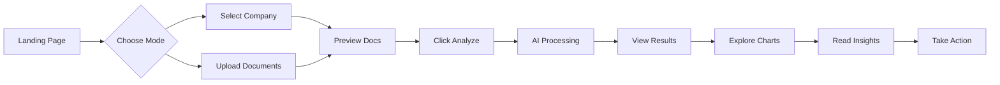

# 🎨 UI/UX Documentation - AI Analyst for Startup Evaluation

## 📋 Table of Contents
1. [Overview](#overview)
2. [UI Architecture](#ui-architecture)
3. [Design Philosophy](#design-philosophy)
4. [User Journey](#user-journey)
5. [Page Structure](#page-structure)
6. [Component Breakdown](#component-breakdown)
7. [Color System](#color-system)
8. [Interactive Elements](#interactive-elements)
9. [Data Visualizations](#data-visualizations)
10. [Responsive Design](#responsive-design)
11. [Accessibility Features](#accessibility-features)

---

## 🎯 Overview

This Streamlit application provides an AI-powered analyst platform for startup evaluation, developed for the GenAI Exchange Hackathon. It synthesizes founder materials and public data to generate actionable investment insights.

### Key Features:
- 🏢 **Pre-loaded Company Data** - 14 startups ready for instant analysis
- 📁 **Dual Mode System** - Choose between pre-loaded companies or upload custom documents
- 👁️ **Document Preview** - In-browser PDF viewer with download options
- 🤖 **AI Analysis** - Sector-specific evaluation using Google AI technologies
- 📊 **Interactive Dashboards** - Multiple visualization types with benchmarking
- 💡 **Smart Recommendations** - Context-aware investment insights
- 🎯 **Quick Selection Cards** - Featured startups with industry badges
- 📦 **Bulk Operations** - Download all documents as ZIP archive
- 🎨 **Google Material Design** - Clean, modern interface with dark theme

---

## 🎨 UI Architecture

The UI is built with **Streamlit** (`app.py`) and follows Google Material Design principles with a dark theme.

### 📊 **UI Components Overview**

| **Component** | **Function** | **Location** |
|--------------|-------------|------------|
| **Header** | `display_header()` | Lines 231-253 |
| **File Upload** | `handle_file_uploads()` | Lines 538-584 |
| **Metrics Cards** | `display_metrics()` | Lines 589-640 |
| **Charts** | `create_*_chart()` | Lines 284-533 |
| **Insights Panel** | `display_insights()` | Lines 645-682 |
| **Main App** | `main()` | Lines 687-899 |

### 🔄 **UI State Management**

```python
# Session state variables that control the UI
st.session_state.show_results    # Toggle upload/results view
st.session_state.results_df      # Analysis data for charts
st.session_state.summary_df      # Metrics display data
```

---

## 🎨 Design Philosophy

### Core Principles:
1. **Simplicity First** - Complex analysis made simple
2. **Visual Hierarchy** - Important information stands out
3. **Progressive Disclosure** - Show details only when needed
4. **Consistent Feedback** - Users always know what's happening
5. **Google Design Language** - Familiar patterns from Google products

### Theme:
- **Dark Mode** - Reduces eye strain during long analysis sessions
- **Google Colors** - Blue, Red, Yellow, Green for brand consistency
- **High Contrast** - Ensures readability in all conditions

---

## 🚀 User Journey



### 1. **Landing Page** (Initial State)
   - Large header: "AI Analyst for Startup Evaluation"
   - Team branding: "Team Gen AI Crew"
   - Tagline: "Synthesizing founder materials & public data → Actionable investment insights"
   - Mode selector: Company Selection vs Manual Upload

### 2. **Data Source Selection**
   - **Option A: Company Selection**
     - Quick selection cards for 6 featured startups
     - Full dropdown with 14 companies
     - Shows company sector, stage, and tags
     - Document preview with tabs
   - **Option B: Manual Upload**
     - Required: Pitch Deck (PDF)
     - Optional: Call Transcripts, Emails, Founder Docs
     - Visual feedback for successful uploads

### 3. **Document Preview** (New Feature)
   - Three tabs: Documents, Preview, Downloads
   - Embedded PDF viewer
   - Individual document downloads
   - Bulk download as ZIP
   - File size information

### 4. **Analysis Process**
   - Dynamic progress bar with steps
   - Status messages: "Loading documents", "Extracting information", etc.
   - Company name shown during analysis
   - Success message with company context

### 5. **Results Dashboard**
   - Company name banner at top
   - Executive summary with 4 key metrics
   - Multiple visualization options in tabs
   - AI-powered insights with sector context
   - Benchmark comparisons with peer companies

---

## 🏗️ Page Structure

### Header Section
```
┌─────────────────────────────────────────┐
│   🚀 AI Analyst for Startup Evaluation  │ <- Main Title (3.5rem)
│         ✨ Team Gen AI Crew ✨           │ <- Team Name (2.5rem)
│  Synthesizing founder materials & data  │ <- Tagline (1.2rem)
│   GenAI Exchange Hackathon 2024 | Google│ <- Event Info (1rem)
└─────────────────────────────────────────┘
```

### Company Selection Mode Layout
```
┌─────────────────────────────────────────┐
│            HEADER SECTION                │
├─────────────────────────────────────────┤
│   🎯 Choose Data Source                  │
│ [📊 Select Company] [📤 Upload Custom]   │
├─────────────────────────────────────────┤
│      🎯 Quick Selection - Featured       │
│ [We360 AI] [Kredily] [Dr.Doodley]       │
│ [Ctruh] [Sensesemi] [Naario]            │
├──────────────┬──────────────────────────┤
│  Company     │    AI Analysis Preview   │
│  Selector    │    • Sector: FinTech     │
│  Dropdown    │    • Stage: Growth       │
│              │    • Benchmarks: 3 peers │
│  📋 Documents│    ✅ Ready for Analysis │
│  [Tabs View] │                          │
├──────────────┴──────────────────────────┤
│      [🔍 Analyze {Company Name}]        │
└─────────────────────────────────────────┘
```

### Manual Upload Mode Layout
```
┌─────────────────────────────────────────┐
│            HEADER SECTION                │
├─────────────────────────────────────────┤
│   🎯 Choose Data Source                  │
│ [📊 Select Company] [📤 Upload Custom]   │
├──────────────┬──────────────────────────┤
│   Required   │      Optional            │
│   Documents  │      Documents           │
│              │                          │
│  [PDF Upload]│  [DOC Upload]            │
│              │  [TXT Upload]            │
│              │  [DOC Upload]            │
├──────────────┴──────────────────────────┤
│         [🔍 Analyze Documents]           │
└─────────────────────────────────────────┘
```

### Results Mode Layout
```
┌─────────────────────────────────────────┐
│            HEADER SECTION                │
├─────────────────────────────────────────┤
│      🏢 Analyzing: {Company Name}        │
├─────────────────────────────────────────┤
│    📊 Executive Summary (4 Metrics)      │
│  [Score] [Risk] [Flags] [Recommendations]│
├──────────────┬──────────────────────────┤
│   Gauge      │    Tabbed Charts         │
│   Chart      │  [Trends][Radar][Heat]   │
│              │     [Data Editor]        │
│   Key        │                          │
│   Metrics    │                          │
├──────────────┴──────────────────────────┤
│      🔍 AI Analysis Insights             │
│   [Risk Assessment] [AI Recommendations] │
│   • High churn - Refer page 1           │
│   • Sector risks • Focus areas          │
├─────────────────────────────────────────┤
│  [Re-analyze][Download][Share][New]      │
└─────────────────────────────────────────┘
```

---

## 🧩 Component Breakdown

### 1. **Metrics Cards** 
- **Location**: Lines 589-640
- **Shows**: Score, Risk Level, Red Flags, Recommendations
- **Design**: Google-styled cards with delta indicators

### 2. **File Uploaders** (`handle_file_uploads()`)
- **Purpose**: Dual-mode document input system
- **Features**:
  - Mode selector (Company vs Manual)
  - Company dropdown with 14 options
  - Quick selection cards (6 featured)
  - Document preview tabs
  - Drag-and-drop for manual upload
  - File type validation
  - Success feedback with document count

### 3. **Visualizations**
| **Chart Type** | **Purpose** | **Lines** |
|---------------|------------|-----------|
| **Gauge** | Overall score (0-100) | 284-328 |
| **Line** | Score vs Benchmark trends | 330-420 |
| **Radar** | Multi-parameter view | 422-489 |
| **Heatmap** | Correlation matrix | 491-533 |

### 4. **Insights Panel** (`display_insights()`)
- **Risk Assessment**:
  - Handles list of lists format (points + references)
  - Expandable cards with page references
  - Dynamic risk level detection
  - Sector-specific risk flags
  - Impact and priority indicators
  
- **Recommendations**:
  - AI-generated contextual advice
  - Sector-specific focus areas
  - Due diligence timeline (2-3 weeks)
  - Investment horizon (3-5 years)
  - Key analysis areas display

---

## 🏢 Company Data Features

### Pre-loaded Companies (14 Total)
The system includes data for 14 startups across various sectors:

#### Featured Companies (Quick Selection):
1. **We360 AI** - 🤖 AI Leader
2. **Kredily** - 💰 Fintech 
3. **Dr.Doodley** - 🏥 Healthcare
4. **Ctruh** - 🥽 XR Tech
5. **Sensesemi** - 🔧 Hardware
6. **Naario** - 👩 Social Impact

#### Additional Companies:
7. **Data stride** - Analytics & Data Solutions
8. **Inlustro** - Design & Innovation
9. **Cashvisory** - Financial Advisory
10. **Indishreshtha** - Excellence Platform
11. **Hexafun** - Gaming & Entertainment
12. **Timbuckdo** - Travel & Tourism
13. **Multipl** - Multiple Ventures
14. **Ziniosa** - Innovation Platform

### Company Data Management (`Utils/company_data_loader.py`)
- **Smart Document Classification**: Automatically categorizes pitch decks, memos, financials
- **Sector Metadata**: Tags, stage, and industry information
- **Benchmark Generation**: Finds comparable companies
- **Analysis Context**: Sector-specific risks and focus areas

### Document Preview System
```
┌─────────────────────────────────────────┐
│         📋 Available Documents           │
├─────────────────────────────────────────┤
│  [📄 Documents] [👁️ Preview] [📥 Downloads]│
├─────────────────────────────────────────┤
│  Preview Tab:                           │
│  • Select document dropdown              │
│  • Embedded PDF viewer                  │
│  • View option: Inline/Download         │
│  • File size display                    │
├─────────────────────────────────────────┤
│  Downloads Tab:                         │
│  • Individual document buttons          │
│  • [📦 Download All as ZIP]             │
└─────────────────────────────────────────┘
```

---

## 🎨 Color System

### Primary Colors (Google Brand)
```css
GOOGLE_BLUE    = "#4285F4"  /* Primary actions, links */
GOOGLE_GREEN   = "#34A853"  /* Success states, positive */
GOOGLE_YELLOW  = "#FBBC05"  /* Warnings, attention */
GOOGLE_RED     = "#EA4335"  /* Errors, critical issues */
```

### Background Colors
```css
GOOGLE_DARK_GRAY = "#202124"  /* Main background */
BG_SECONDARY     = "#303134"  /* Card backgrounds */
BG_CARD          = "#3c4043"  /* Elevated surfaces */
```

### Text Colors
```css
TEXT_PRIMARY   = "#e8eaed"  /* Main text */
TEXT_SECONDARY = "#9aa0a6"  /* Subtle text */
```

### Usage Examples:
- **Blue**: Analyze button, primary metrics, links
- **Green**: Success messages, positive trends
- **Yellow**: Medium risk indicators
- **Red**: High risk flags, critical alerts

---

## 🎮 Interactive Elements

### Button Actions
```python
[🔍 Analyze Documents]  # Primary action - Line 728
[🔄 Re-analyze]        # Refresh results - Line 862  
[📥 Download]          # Export CSV - Line 873
[➕ New Analysis]      # Reset UI - Line 887
```

### State Management
- **Session State Variables**:
  - `show_results`: Toggle between upload/results view
  - `results_df`: Stores analysis data
  - `summary_df`: Stores summary metrics
  - `analysis_progress`: Tracks analysis completion
  - `upload_mode`: 'company_selector' or 'manual'
  - `selected_company`: Currently selected company name
  - `analyzed_company`: Company being analyzed in results

### User Interactions:
1. **Mode Selection** → Interface change
2. **Company Select** → Document load + preview
3. **Quick Card Click** → Instant company selection
4. **Document Tab** → Switch between list/preview/download
5. **File Upload** → Visual feedback
6. **Button Click** → Loading state → Result
7. **Tab Switch** → Instant chart change
8. **Data Edit** → Real-time update
9. **Expander Click** → Smooth reveal
10. **Download Button** → File save dialog

---

## 📊 Data Visualizations

### 1. **Gauge Chart** (Investment Readiness)
- **What it shows**: Overall startup score
- **How to read**: Higher is better, green zone is ideal
- **Interactive**: Hover for exact value

### 2. **Line Chart** (Performance Trends)
- **What it shows**: Multiple metrics over parameters
- **Blue Line**: Actual scores
- **Red Dashed**: Minimum thresholds
- **Green Line**: Industry benchmarks

### 3. **Radar Chart** (Multi-Parameter View)
- **What it shows**: Strengths and weaknesses
- **Blue Area**: Startup's performance
- **Red Area**: Required minimums
- **Gap Analysis**: Space between shows improvement areas

### 4. **Heatmap** (Correlation Matrix)
- **What it shows**: How parameters relate
- **Dark Red**: Strong negative correlation
- **Dark Green**: Strong positive correlation
- **Gray**: No correlation

### 5. **Bar Chart** (Weighted Scores)
- **What it shows**: Contribution of each parameter
- **Color Coding**: Alternating Google colors
- **Height**: Importance to final score

---

## 📄 Document Management

### Document Types Supported
- **PDF Files**: Pitch decks, investment memos, financial reports
- **Word Documents** (.docx, .doc): Founders checklists, updates
- **Text Files** (.txt): Call transcripts, email correspondence

### Document Classification System
```python
DOCUMENT_PATTERNS = {
    'pitch_deck': ['pitch', 'deck', 'presentation'],
    'founders_checklist': ['checklist', 'founders', 'lv'],
    'investment_memo': ['investment', 'memorandum', 'memo'],
    'financials': ['financial', 'audited', 'accounts'],
    'call_transcript': ['call', 'transcript', 'meeting'],
    'email': ['email', 'correspondence']
}
```

### Preview Features
- **Embedded PDF Viewer**: Uses base64 encoding for inline display
- **Fallback Options**: Download button for unsupported browsers
- **File Size Display**: Shows document size in MB
- **View Toggle**: Choice between inline viewing and download

### Download Options
- **Individual Downloads**: Separate buttons per document type
- **Bulk Download**: ZIP archive with all company documents
- **Smart MIME Types**: Correct content types for each file format

---

## 📱 Responsive Design

### Layout Adaptations:
- **Wide Layout**: `layout="wide"` in page config
- **Column System**: Flexible columns adjust to screen size
- **Container Width**: `use_container_width=True` for charts

### Screen Size Considerations:
```python
# Desktop (>1200px)
[Col1: 25%] [Col2: 75%]  # Sidebar + Main content

# Tablet (768-1200px)
[Col1: 33%] [Col2: 67%]  # Compressed sidebar

# Mobile (<768px)
[Full Width Stacked]      # Everything vertical
```

---

## ♿ Accessibility Features

### Visual Accessibility:
- **High Contrast**: Dark background with light text
- **Color Indicators**: Not solely relied upon (text labels included)
- **Font Sizes**: Hierarchical sizing for readability
- **Icons**: Accompanied by text labels

### Interactive Accessibility:
- **Keyboard Navigation**: Tab through all elements
- **Focus Indicators**: Visible focus states
- **Loading States**: Clear progress indicators
- **Error Messages**: Descriptive and actionable

### Screen Reader Support:
- **Alt Text**: For all images and icons
- **ARIA Labels**: On interactive elements
- **Semantic HTML**: Proper heading hierarchy
- **Status Updates**: Announced to screen readers

---

## 🔧 Customization Guide

### To Change Colors:
1. Find color constants at top of `app.py`
2. Update hex values
3. Colors automatically apply throughout

### To Add New Charts:
1. Create function like `create_[chart_name]_chart()`
2. Add new tab in results section
3. Call function with data

### To Modify Layout:
1. Adjust column ratios in `st.columns()`
2. Change component order in `main()`
3. Update CSS in `apply_custom_css()`

---

## 💡 UI Best Practices

### When Adding Features:
1. **Follow existing patterns** - Keep consistency
2. **Use color system** - Don't hardcode colors
3. **Add loading states** - Never leave users waiting
4. **Provide feedback** - Success/error messages
5. **Test dark mode** - Ensure readability

### Code Organization:
```python
# Current Structure:
# app.py:
#   1. Imports (including company_data_loader)
#   2. Constants (Google colors)
#   3. CSS/Styling (apply_custom_css)
#   4. Header/Footer Components
#   5. Chart Functions
#   6. File Upload Handler (dual mode)
#   7. Metrics & Insights Display
#   8. Main Application Logic

# Utils/company_data_loader.py:
#   1. Company metadata dictionaries
#   2. Document classification
#   3. Loading functions
#   4. Benchmark generation
#   5. Analysis context creation
```

### Performance Tips:
- Use `@st.cache_data` for heavy computations
- Minimize reruns with proper state management
- Load large data asynchronously
- Optimize chart rendering

---

## 🚦 Status Indicators

### Visual Feedback System:
- ✅ **Success**: Green checkmark + message
- ⚠️ **Warning**: Yellow triangle + explanation  
- ❌ **Error**: Red X + actionable message
- 🔄 **Loading**: Spinner + progress bar
- 📎 **Ready**: Blue info box

---

## 💡 Tips for First-Time Users

1. **Try Quick Selection** - Use featured company cards for instant analysis
2. **Preview Documents First** - Verify data before analysis
3. **Start with Pre-loaded Data** - 14 companies ready to analyze
4. **Watch the Progress Steps** - Shows what AI is analyzing
5. **Check Benchmark Companies** - See peer comparisons
6. **Explore All Tabs** - Different views reveal different insights
7. **Read Page References** - Red flags link to specific document pages
8. **Edit Data** - You can modify scores in the Data tab
9. **Download Everything** - Use ZIP download for all documents
10. **Try Different Companies** - Compare sectors and stages

---

## 🆘 Troubleshooting UI Issues

### Common Problems:
1. **Charts not showing**: Check if data exists
2. **Buttons not working**: Ensure required fields filled
3. **Layout broken**: Refresh browser
4. **Colors look wrong**: Check browser dark mode settings
5. **PDF not previewing**: Try download option instead
6. **Company not loading**: Check if documents exist in data folder
7. **Red flags error**: Fixed - handles list format now
8. **Mode switch stuck**: Clear session state and refresh
9. **Downloads failing**: Check browser download permissions
10. **Preview tabs empty**: Ensure company is selected first

---

## 📁 UI File Structure (`app.py`)

```
Configuration       Lines 1-27
CSS Styling        Lines 32-226  
Header/Footer      Lines 231-278
Chart Functions    Lines 284-533
Upload Handler     Lines 538-584
Metrics Display    Lines 589-640
Insights Display   Lines 645-682
Main Application   Lines 687-899
```

## 📚 Further Reading

- [Streamlit Documentation](https://docs.streamlit.io)
- [Google Material Design](https://material.io/design)
- [Plotly Charts](https://plotly.com/python/)
- [Dark UI Best Practices](https://material.io/design/color/dark-theme.html)
- [GenAI Exchange Hackathon](https://vision.hack2skill.com/event/genaiexchangehackathon)

---

## 📝 Recent Updates & Changes

### Version 2.0 - Major Enhancement (Current)
**New Features:**
- ✅ **Company Data Integration**: 14 pre-loaded companies with automatic document loading
- ✅ **Dual Mode Operation**: Toggle between company selection and manual upload
- ✅ **Quick Selection Cards**: 6 featured startups with industry badges
- ✅ **Document Preview System**: Embedded PDF viewer with tabs
- ✅ **Bulk Downloads**: ZIP archive for all company documents
- ✅ **Enhanced AI Insights**: Sector-specific analysis and benchmarking
- ✅ **Smart Classification**: Automatic document type detection
- ✅ **Company Context**: Analysis context persists throughout session

**Bug Fixes:**
- ✅ Fixed AttributeError with red flags list handling
- ✅ Improved error handling for various data formats
- ✅ Added proper imports (io, base64, zipfile, tempfile)

**UI Improvements:**
- ✅ Updated header with hackathon context
- ✅ Dynamic button text based on selection
- ✅ Progress steps during analysis
- ✅ Company name display in results
- ✅ Page references in risk assessment

**Architecture Changes:**
- ✅ Created `Utils/company_data_loader.py` module
- ✅ Separated concerns between UI and data management
- ✅ Added metadata for sector-based analysis

---