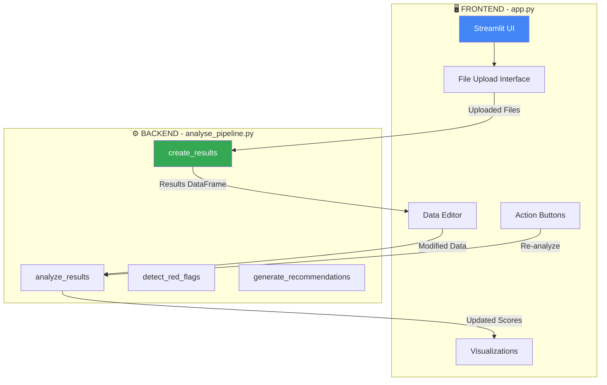
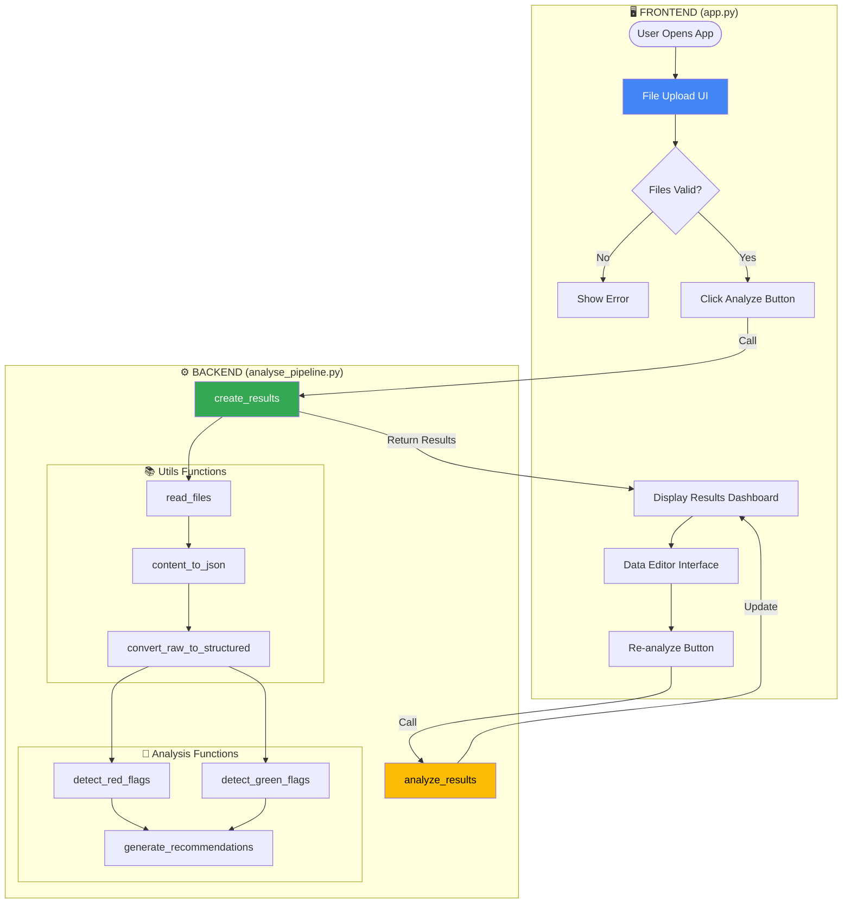
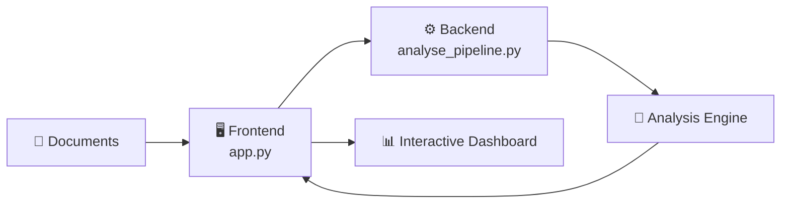
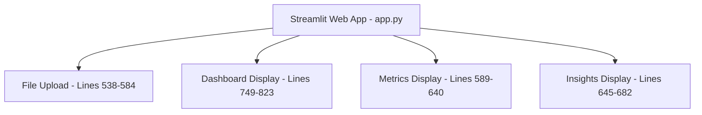
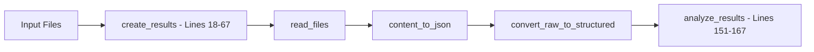
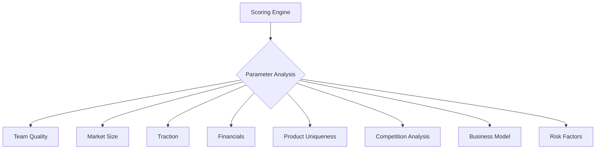
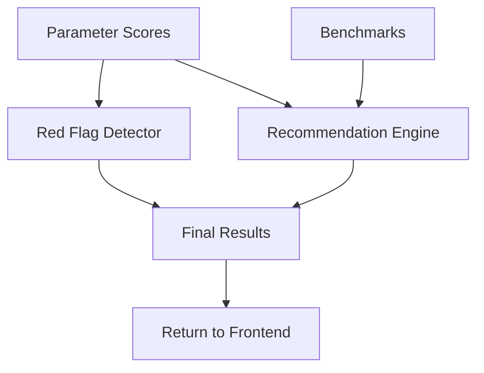

# 🏗️ Architecture Documentation

## 🎯 Frontend-Backend Separation

The application follows a clear **Frontend-Backend architecture**:

- **🖥️ Frontend (`app.py`)**: Streamlit-based UI that handles user interactions, file uploads, and data visualization
- **⚙️ Backend (`analyse_pipeline.py`)**: Core processing engine that performs analysis, scoring, and recommendation generation

## 🔄 Complete Application Flow

## 🏛️ High-Level System Overview

## 📋 Key Function Calls Between Frontend & Backend

| **Frontend Action (app.py)** | **Backend Function Called** | **Purpose** | **Returns** |
|------------------------------|----------------------------|------------|-------------|
| **User clicks "🔍 Analyze"** | `create_results(uploaded_files)` | Initial document analysis | summary_df, results_df, score, flags, recommendations |
| **User edits data in UI** | `analyze_results(structured_df)` | Re-calculate scores | final_score, flags, recommendations |
| **User clicks "🔄 Re-analyze"** | `analyze_results(structured_df)` | Refresh analysis | final_score, flags, recommendations |
| **Dashboard loads** | Uses returned DataFrames | Display results | N/A - uses stored session state |

## 🔧 Detailed Architecture Layers

### 🎨 Layer 1: Frontend User Interface (`app.py`)

### ⚙️ Layer 2: Backend Processing Pipeline (`analyse_pipeline.py`)

### 🧠 Layer 3: Analysis Engine (8 Parameters)

### 🤖 Layer 4: Intelligence & Output

## 🧩 Detailed Component Architecture

### 🎨 1. User Interface Layer
- **🖥️ [`Streamlit Web App`](../app.py)** - Main application interface
  - **📤 [File Upload Interface](../app.py#L18-L23)**: Multi-format document upload with validation
  - **📊 [Interactive Dashboard](../app.py#L35-L89)**: Real-time results display and editing
  - **📈 [Data Visualizations](../app.py#L78-L89)**: Charts, trends, and benchmark comparisons

### ⚙️ 2. Processing Pipeline Layer
- **🔄 [`Main Pipeline`](../analyse_pipeline.py#L7-L55)** - Orchestrates entire analysis workflow
  - **📖 [`File Reader`](../Utils/utils.py#L42-L51)** - Batch processing of uploaded documents
  - **🔍 [`Parameter Extractor`](../Utils/pdf_file_reader.py#L15-L51)** - AI-powered content analysis
  - **🎯 [`Scoring Engine`](../Utils/structured_2_scored_data.py#L69-L146)** - Transforms text to numerical scores

### 🧠 3. Analysis Engine - 8-Parameter Evaluation System
- **👥 [`Team Scorer`](../Utils/structured_2_scored_data.py#L44-L51)** - Educational background + experience analysis
- **🌍 [`Market Analyzer`](../Utils/structured_2_scored_data.py#L9-L24)** - TAM size evaluation with regex parsing
- **📈 [`Traction Evaluator`](../Utils/structured_2_scored_data.py#L26-L42)** - User growth + MoM metrics
- **💰 [Financial Scorer](../Utils/structured_2_scored_data.py#L87)** - Revenue, ARR, burn rate assessment
- **🚀 [Product Scorer](../Utils/structured_2_scored_data.py#L88)** - Innovation, differentiation, AI/tech analysis
- **🏆 [Competition Analyzer](../Utils/structured_2_scored_data.py#L89-L91)** - Market saturation and competitive positioning
- **💼 [Business Model Scorer](../Utils/structured_2_scored_data.py#L92)** - Revenue model clarity and scalability
- **⚠️ [Risk Assessor](../Utils/structured_2_scored_data.py#L93)** - Regulatory, operational, market risk evaluation

### 🤖 4. Intelligence Layer - Advanced Analytics
- **🚨 [`Red Flag Detector`](../analyse_pipeline.py#L88-L110)** - Threshold-based risk identification
- **💡 [`Recommendation Engine`](../analyse_pipeline.py#L112-L118)** - Actionable insights generation
- **📊 [`Benchmark Comparator`](../data/sector_benchmarks.csv)** - Industry-specific performance analysis

### 📚 5. Data Layer - Information Management
- **📄 Input Documents** - Multi-format file processing (PDF, DOCX, TXT)
- **📊 Benchmark Data** - Sector-specific performance metrics
- **⚙️ Configuration** - Parameter weights, thresholds, scoring rules
- **📋 Analysis Results** - Structured output with scores, flags, recommendations
