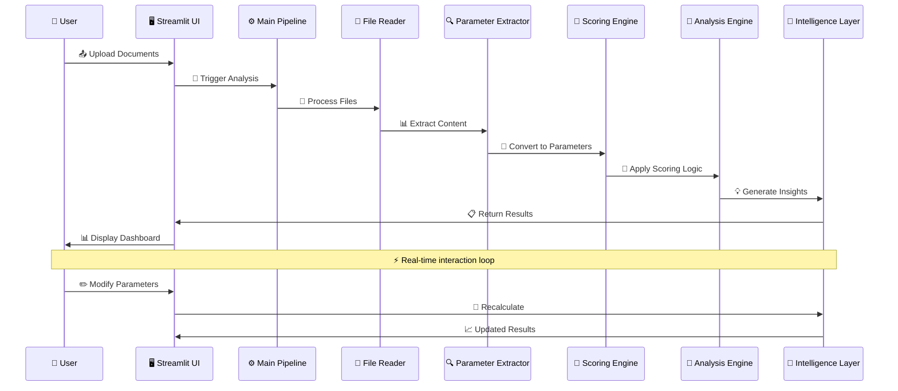
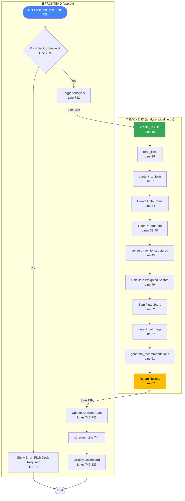
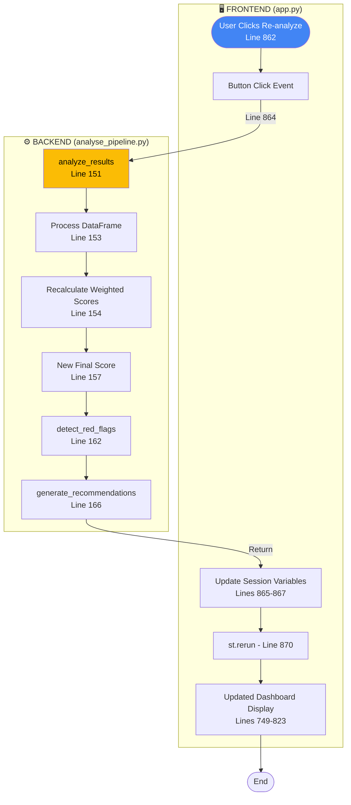
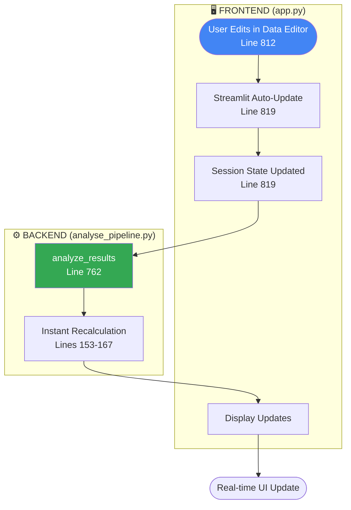

# 🔄 Data Flow Documentation

## 📋 Overview
This document describes how data flows through the GenAI Hackathon startup analysis platform, from document upload to final analysis results.

## 🔄 Data Flow Architecture

## 🔄 Execution Flows

### 🚀 Initial Analysis Flow (When User Clicks "🔍 Analyse")

### 🔄 Re-Analysis Flow (When User Clicks "🔄 Analyse Again")

### ✏️ Interactive Parameter Editing Flow (Real-time Updates)

## 📤 1. Input Processing

### 📁 File Upload & Validation
- **🖥️ UI Components**: See [`app.py:18-23`](../app.py#L18-L23) for Streamlit file uploaders
- **📖 File Processing**: [`read_files()`](../Utils/utils.py#L42-L51) function in `Utils/utils.py`
- **📄 Individual File Reading**: [`read_file()`](../Utils/utils.py#L8-L39) function in `Utils/utils.py`

### ⚙️ Supported Operations:
- **📄 PDF Processing**: PyPDF2-based text extraction ([`read_file()` lines 18-24](../Utils/utils.py#L18-L24))
- **📝 DOCX/DOC Processing**: python-docx integration ([`read_file()` lines 26-32](../Utils/utils.py#L26-L32)) 
- **📄 TXT Processing**: UTF-8 decoding ([`read_file()` lines 34-35](../Utils/utils.py#L34-L35))

## 🤖 2. AI Analysis & Content Extraction 🚧 **[PARTIALLY IMPLEMENTED]**

### 🔄 Content Structure Conversion
- **🧠 Main Function**: [`content_to_json()`](../Utils/pdf_file_reader.py#L15-L51) 🚧 **[TO BE IMPLEMENTED]** - Currently uses sample data
- **📊 DataFrame Creation**: See [`analyse_pipeline.py:23-28`](../analyse_pipeline.py#L23-L28) ✅ **[WORKING]** - Parameter extraction pipeline
- **🔍 Data Filtering**: Non-evaluating parameters removed ([lines 29-30](../analyse_pipeline.py#L29-L30)) ✅ **[WORKING]**

**📋 Output Format**: Structured JSON with company parameters (name, sector, team, market, traction, revenue, USP, competition, risks)

**⚠️ Note**: Currently uses hardcoded sample data - AI integration needed for production use

## 🎯 3. Scoring Pipeline

### 🔧 Parameter Scoring Functions
All functions located in [`Utils/structured_2_scored_data.py`](../Utils/structured_2_scored_data.py):

- **👥 Team Quality**: [`parse_team()`](../Utils/structured_2_scored_data.py#L44-L51) function - IIT/IIM bonus scoring
- **🌍 Market Size**: [`parse_market_size()`](../Utils/structured_2_scored_data.py#L9-L24) function - Billion/Million market analysis  
- **📈 Traction**: [`parse_traction()`](../Utils/structured_2_scored_data.py#L26-L42) function - User growth and MoM metrics
- **📊 Other Parameters**: [Lines 84-94](../Utils/structured_2_scored_data.py#L84-L94) for Financials, Product Uniqueness, Competition, etc.

### ⚖️ Weighted Calculation:
- **🎯 Weights Definition**: [Lines 117-126](../Utils/structured_2_scored_data.py#L117-L126) in structured_2_scored_data.py
- **🧮 Score Calculation**: [`analyse_pipeline.py:38-43`](../analyse_pipeline.py#L38-L43) for weighted final score

## 📊 4. Analysis Output & Risk Detection

### 🚨 Red Flag Detection
- **⚙️ Function**: [`detect_red_flags()`](../analyse_pipeline.py#L88-L110) in `analyse_pipeline.py`
- **🎯 Logic**: Compares scores against thresholds with page references

### 💡 Recommendation Engine
- **⚙️ Function**: [`generate_recommendations()`](../analyse_pipeline.py#L112-L118) in `analyse_pipeline.py`
- **📋 Output**: Parameter-specific actionable insights

## ⚡ Key Execution Points

| **🎯 Execution Stage** | **🔧 Function Called** | **📁 File Location** |
|---------------------|-------------------|------------------|
| **📤 File Upload Validation** | File upload check | [`app.py:26-27`](../app.py#L26-L27) |
| **📖 File Content Reading** | [`read_files()`](../Utils/utils.py#L42-L51) | `Utils/utils.py` |
| **🔍 Parameter Extraction** | [`content_to_json()`](../Utils/pdf_file_reader.py#L15-L51) | `Utils/pdf_file_reader.py` |
| **🎯 Scoring Conversion** | [`convert_raw_to_structured()`](../Utils/structured_2_scored_data.py#L69-L146) | `Utils/structured_2_scored_data.py` |
| **📊 Individual Parameter Scoring** | [`parse_team()`](../Utils/structured_2_scored_data.py#L44-L51), [`parse_market_size()`](../Utils/structured_2_scored_data.py#L9-L24), etc. | `Utils/structured_2_scored_data.py` |
| **🧮 Final Score Calculation** | Weighted sum | [`analyse_pipeline.py:38-41`](../analyse_pipeline.py#L38-L41) |
| **🚨 Red Flag Detection** | [`detect_red_flags()`](../analyse_pipeline.py#L88-L110) | `analyse_pipeline.py` |
| **💡 Recommendation Generation** | [`generate_recommendations()`](../analyse_pipeline.py#L112-L118) | `analyse_pipeline.py` |
| **📊 Dashboard Display** | Streamlit rendering | [`app.py:35-89`](../app.py#L35-L89) |

## ⚠️ Error Handling Points

- **📤 File Upload Validation** - [`app.py:26-28`](../app.py#L26-L28) - Missing pitch deck check
- **📖 File Reading Errors** - [`Utils/utils.py:30-31`](../Utils/utils.py#L30-L31) - DOCX processing exceptions  
- **🔍 Content Extraction** - [`Utils/pdf_file_reader.py`](../Utils/pdf_file_reader.py) - Malformed document handling
- **🎯 Scoring Validation** - [`Utils/structured_2_scored_data.py`](../Utils/structured_2_scored_data.py) - Invalid parameter values
