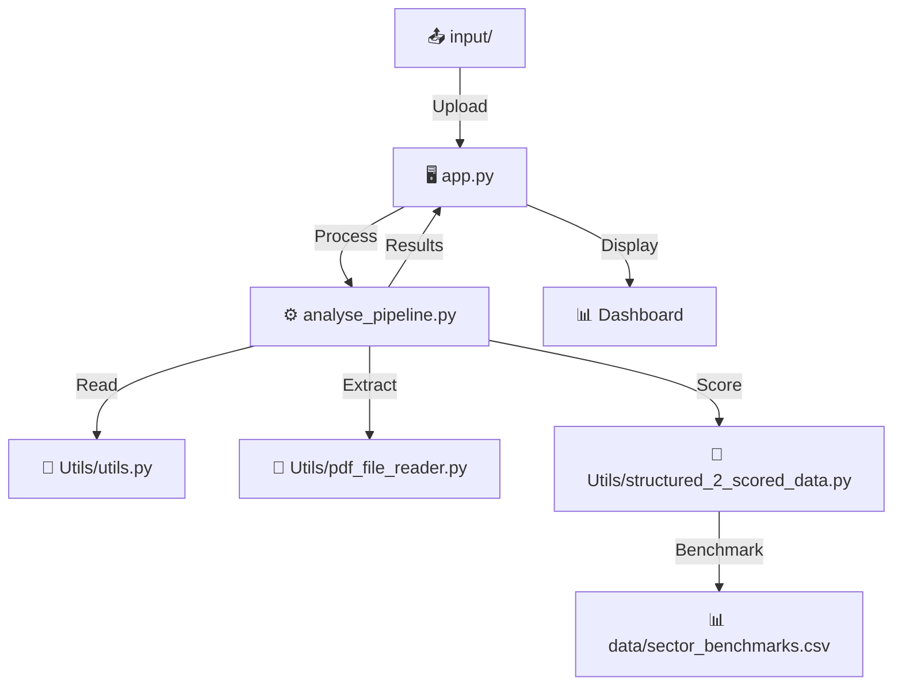
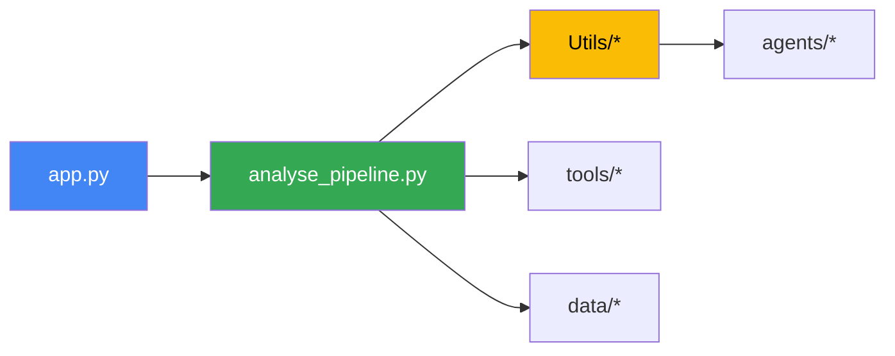

# 📁 Project Structure

## 📂 Directory Overview

```
🚀 GenAI_Hackathon/
├── 🖥️ app.py                    # Main Streamlit application
├── ⚙️ analyse_pipeline.py       # Core analysis pipeline
├── 📋 README.md                 # Main documentation
├── 📝 readme.md                 # Secondary readme file
├── 📦 requirements.txt          # Python dependencies
├── 🐍 __init__.py               # Python package initialization
│
├── 📚 docs/                     # Documentation folder
│   ├── 🏗️ architecture.md       # System architecture details
│   ├── 🔧 api-reference.md      # API documentation
│   ├── 🔄 data-flow.md          # Data flow documentation
│   ├── ⚙️ configuration.md      # Configuration guide
│   ├── 🔍 troubleshooting.md    # Troubleshooting guide
│   ├── 🎨 UI-UX.md              # UI/UX documentation
│   ├── 🚀 SETUP_INSTRUCTIONS.md # Installation guide
│   └── 📁 project-structure.md  # This file
│
├── 🔧 Utils/                    # Utility modules
│   ├── 🛠️ utils.py              # File processing utilities
│   ├── 📄 pdf_file_reader.py    # PDF content extraction
│   ├── 🎯 structured_2_scored_data.py  # Scoring algorithms
│   └── 🧮 final_score.py        # Final score calculation
│
├── 🛠️ tools/                    # Processing tools
│   ├── 🔨 tools.py              # PDF processing tools
│   ├── 💬 prompts.py            # AI prompts and templates
│   └── 🐍 __init__.py           # Package initialization
│
├── 📊 data/                     # Data and benchmarks
│   ├── 📈 sector_benchmarks.csv # Industry benchmarks
│   ├── 📋 data_extracted.json   # Sample extracted data
│   ├── 🔄 data_normalized.json  # Processed data samples
│   ├── 📊 data_score.json       # Scored data results
│   ├── 📝 data_score_sample.json # Sample scoring data
│   └── 📁 archieve/             # Historical data
│       └── 📋 startup_parameters.csv
│
├── 📤 input/                    # Sample documents
│   ├── 📊 startup_ptch_deck.pdf # Main startup pitch deck
│   ├── 📈 FinTechX_ AI-Powered SME Lending Revolution.pdf # FinTech example
│   ├── 📝 transcript.txt        # Call transcript sample
│   ├── 📝 pitch_deck_draft.txt  # Text-based pitch deck
│   ├── 📧 email.docx            # Email communication sample
│   └── 👤 founder_material.docx # Founder background info
│
└── 🤖 agents/                   # AI agents (future)
    ├── 💼 investor_agent.py     # Investment analysis agent
    ├── 💡 recommendation_prompt.py # Recommendation generation
    └── 🐍 __init__.py           # Package initialization
```

## 📄 File Descriptions

### 🖥️ Core Application Files

| **File** | **Purpose** | **Key Functions** |
|----------|-------------|-------------------|
| `app.py` | Main Streamlit web interface | File upload, dashboard display, user interactions |
| `analyse_pipeline.py` | Backend analysis engine | `create_results()`, `analyze_results()`, scoring logic |
| `requirements.txt` | Dependency management | Lists all required Python packages |

### 🔧 Utils Module

| **File** | **Purpose** | **Key Functions** |
|----------|-------------|-------------------|
| `utils.py` | File I/O operations | `read_file()`, `read_files()` - Multi-format file reading |
| `pdf_file_reader.py` | Content extraction | `content_to_json()` - Convert text to structured data |
| `structured_2_scored_data.py` | Scoring algorithms | `parse_team()`, `parse_market_size()`, `parse_traction()` |
| `final_score.py` | Score aggregation | Weighted score calculation |

### 🛠️ Tools Module

| **File** | **Purpose** | **Status** |
|----------|-------------|------------|
| `tools.py` | Advanced PDF processing | OCR support, complex extraction |
| `prompts.py` | AI prompt templates | LLM integration prompts |

### 📊 Data Directory

| **File/Folder** | **Content Type** | **Usage** |
|-----------------|------------------|-----------|
| `sector_benchmarks.csv` | Industry metrics | Comparison benchmarks |
| `data_extracted.json` | Raw extraction | Sample parameter extraction |
| `data_normalized.json` | Normalized data | Processed parameters |
| `data_score.json` | Scoring results | Final scored output |
| `archieve/` | Historical data | Previous analyses |

### 📤 Input Directory

| **File** | **Type** | **Purpose** |
|----------|----------|-------------|
| `startup_ptch_deck.pdf` | PDF | Sample pitch deck for testing |
| `FinTechX_*.pdf` | PDF | FinTech startup example |
| `transcript.txt` | Text | Call transcript sample |
| `email.docx` | Word | Email communications |
| `founder_material.docx` | Word | Founder background info |

### 🤖 Agents Module

| **File** | **Purpose** | **Status** |
|----------|-------------|------------|
| `investor_agent.py` | Investment analysis logic | In development |
| `recommendation_prompt.py` | Recommendation generation | Active |

## 🔄 Data Flow Through Structure



## 🏗️ Module Dependencies



## 🚀 Adding New Features

### Creating New Scoring Parameters

1. **Add parser function** in `Utils/structured_2_scored_data.py`:
```python
def parse_new_parameter(param_str):
    # Implementation
    return score
```

2. **Update weights** in same file:
```python
weights['New_Parameter'] = 0.10
```

3. **Add to pipeline** in `analyse_pipeline.py`

### Adding New File Formats

1. **Extend `read_file()`** in `Utils/utils.py`:
```python
elif file_extension == '.new':
    # New format processing
    return extracted_text
```

2. **Update supported formats** in `app.py`

### Creating New Agents

1. **Create file** in `agents/` directory
2. **Implement agent logic**
3. **Import in `analyse_pipeline.py`**
4. **Wire up in main pipeline**

## 📦 Package Structure

The project follows a modular architecture:

- **Presentation Layer**: `app.py` (Streamlit UI)
- **Business Logic**: `analyse_pipeline.py` (Core processing)
- **Data Access**: `Utils/` (File I/O, data processing)
- **Intelligence**: `agents/` (AI/ML components)
- **Configuration**: `data/` (Benchmarks, samples)
- **Documentation**: `docs/` (All documentation)

## 🔒 File Permissions

Ensure proper permissions:
```bash
chmod 755 *.py           # Executable Python files
chmod 644 *.txt *.json   # Data files
chmod 755 Utils/ tools/  # Directories
```
